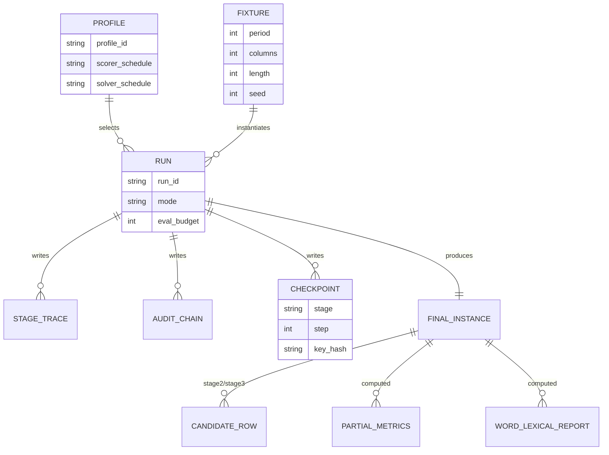

# Final-goal capability review for no‑WLI periodic substitution + transposition in RDP

## Executive summary

The current no‑WLI campaign has proved a meaningful **“basin‑reaching” capability** on the `p9/c3/l1000` hard anchor (credible partial solutions exist), but **evidence in the attached review materials also shows a basin regression inside Stage‑3** and an **invalid Stage‑3.5 proof attempt** (requested Stage‑3.5 did not actually run). fileciteturn2file0 These are not merely “local issues”; they expose the central strategic risk for the final goals: if basin quality and stage execution semantics are not stable and auditable, then any attempt to scale to `p13–p14` will be dominated by attribution ambiguity (was it the method, the scorer, the plumbing, or just luck?).

For the **final goals**—reliable full solves at `p13–p14/l1000`, and reliable human‑meaningful partials at `p13–p14/l500` with ≈0.60–0.70 match and multiple long coherent chunks—the decisive constraint is not “more tuning on p9”, but the combination of:

- **Signal scarcity per period slice** as period increases (sample size per phase falls like `L/p`) which weakens identifiability and makes score landscapes more rugged.
- **Potential regime change around `p11–p14`** where (a) multiple near‑equivalent keys yield similarly plausible language scores, and (b) search becomes dominated by local optima and “false‑plausible” text.
- **Need for stronger priors and multi‑model arbitration**: short-window n‑gram scoring is generally insufficient at `p13–p14/l500` unless augmented by longer-context language modelling, lexical/dictionary evidence, and explicit uncertainty management.

The most relevant external literature supports this framing:

- Classical stochastic cryptanalysis work emphasises **ratio effects** (ciphertext length vs block/structure size) and notes that when full recovery fails, outputs may still provide **valuable clues**. citeturn3search0
- Information theory shows **long‑range statistical effects** in English reduce entropy substantially compared to short‑range models—direct justification for longer-context scorers or rerankers at short lengths. citeturn6search0
- NLP “decipherment” research (treating text mapping as a cipher/channel) shows that many settings require **massive random restarts** and/or stronger objectives (combinatorial optimisation, neural LMs) to break out of local optima. citeturn2search2turn2search1turn2search4

Architecturally, RDP’s staged pipeline, scorer modularity, and audit/trace intent are directionally good, but **final-goal scaling likely requires first-class new concepts**: population-level search as a primitive (not “many independent restarts”), uncertainty-aware selection and arbitration across scorers, richer latent structure (segmentation/route hypotheses), and explicit “human‑useful partial” acceptance logic.

This report is grounded in the provided evidence pack and repo snapshot (as primary evidence) and uses academic/official sources for transferability and wider context. The second-stage scope itself is aligned with the user-supplied “wider” research prompt. fileciteturn2file1

## Evidence base and current capability envelope

### What is evidence-backed from the supplied pack

Evidence-backed conclusions (from the attached review materials, which summarise and cross-check the no‑WLI catalogue and current plan):

- **Stage‑3 basin regression is the main current blocker.** Stage‑2 candidate quality is effectively unchanged, while Stage‑3 top‑k match quality regresses substantially (old Stage‑3 top‑k mean ≈0.77 vs current ≈0.64 in the compared runs). fileciteturn2file0
- The reported **Stage‑3.5 bounded proof attempt was invalid** as a proof: Stage‑3.5 was requested in configuration but the final artefact reported `stage35_enabled_cfg = 0`, `stage35_ran = 0`, `stage35_archive_count = 0`. fileciteturn2file0
- The selector/scorer ladder audit indicates **ranking imperfections exist**, but easy controls are stable and the hard family is not globally inverted (i.e., this is *not* best explained by a completely broken scorer). fileciteturn2file0

These three points matter for the final goals because they imply you cannot yet cleanly distinguish “search failed” from “execution semantics drifted” from “selection/score mismatch” on hard runs—an attribution problem that becomes fatal at `p13–p14` when success events are rarer.

### What is currently missing for final-goal confidence

Even with the review pack, there are gaps that matter for a final-goal capability review:

- There is **limited direct empirical evidence** in the pack for `p13–p14/l500` no‑WLI (the pack emphasises the `p9/c3/l1000` anchor and provides some p11/p13 attempts, but `p14` and `p13–p14/l500` appear underrepresented). This limits the certainty of claims about where exactly a regime change begins; we can still reason about it, but it remains partly inferential.
- Some critical “truth‑independent” measures of human partial usefulness (chunk coherence, stability) are not yet established as first-class benchmark metrics; they must be formalised (proposed below).
- The repo snapshot is “no‑bloat”; some heavy assets (LM weights, calibration artefacts, large corpora) are likely excluded, limiting the ability to examine scorer calibration end-to-end without the full asset set (explicitly listed later).

## Theory of difficulty and regime-change hypotheses

### Quantifying signal per period slice

Let ciphertext length be `L` and substitution period be `p`. In a periodic substitution, positions group into `p` phase classes. **Expected samples per phase** are approximately:

\[
n_{\text{phase}} \approx \frac{L}{p}.
\]

So for your targets:

- `p13/l1000`: \( n_{\text{phase}} \approx 1000/13 \approx 77 \)
- `p14/l1000`: \( n_{\text{phase}} \approx 71 \)
- `p13/l500`: \( n_{\text{phase}} \approx 38 \)
- `p14/l500`: \( n_{\text{phase}} \approx 36 \)

This is the first core driver of difficulty: **as p rises, per-phase evidence falls linearly**, and at `l=500` it becomes *very* small.

If your core scoring signal is based on short n‑grams (e.g., bigram/trigram/char‑4 statistics computed over the decrypted text), the number of *phase-conditioned n‑gram observations* also falls roughly like `L/p` for each phase-pair (bigrams) and phase-triplet (trigrams), because adjacent positions are in a fixed cycle of phases mod `p`. That means the discrimination power of local models decreases sharply as `p` increases.

This is a **structural** limitation, not a software limitation.

### Identifiability vs search limits

At high level, failure can be caused by two different phenomena:

- **Search-limited**: there exists a unique (or near-unique) key that decisively maximises likelihood, but the solver fails to find it.
- **Identifiability-limited**: multiple distinct keys produce similarly plausible-looking plaintext under the available scoring/priors, so even perfect search cannot reliably pick the “true” one from ciphertext alone.

For `p13–p14/l500/no‑WLI`, identifiability limits are a real risk. This is consistent with two primary-source perspectives:

- **Shannon’s entropy/redundancy results**: short-range statistics do not capture all constraints; long-range effects can reduce entropy toward ~1 bit/letter in ordinary English, but you only reap that benefit if your model exploits longer context. citeturn6search0
- **Simulated annealing transposition cryptanalysis**: success depends on the ratio \(L/\text{blocksize}\); at low ratios full recovery may fail, and outputs become “clue-like” rather than exact. citeturn3search0

Interpretation (evidence-backed + judgement):

- **Evidence-backed:** If your scoring signal is dominated by short-range n‑grams, you are effectively operating in a higher-entropy regime than the language truly has. citeturn6search0
- **Judgement:** At `p13–p14/l500`, the combination of small per-phase evidence and short-range modelling will often make the problem identifiability-limited unless you introduce additional strong priors (lexical/dictionary, longer-context LMs, structural constraints).

### Why a regime change around p11–p14 is plausible

The no‑WLI evidence summarised in the pack shows a sharp drop moving from `p9` to higher periods (p11/p13 attempts far below the p9 best basin, even when compute is applied). fileciteturn2file0 That suggests a qualitative shift rather than a smooth taper.

External literature provides strong analogies for such “phase transitions”:

- **Decipherment with many random restarts:** Berg‑Kirkpatrick & Klein show that going from a few restarts to very many can change outcomes from “almost complete failure” to successful decipherment; they also analyse distributions of local optima encountered by EM. citeturn2search2turn2search40  
  This is a key indicator that regimes exist where the landscape is dominated by deceptive local maxima.
- **Low-order n‑gram decipherment limits:** Ravi & Knight analyse “decipherment problems” with low-order n‑gram models, including optimal attacks under those models. citeturn1search10  
  The fact that “optimal” under a low-order model can still fail to recover intended structure is a warning: the model may be insufficiently informative.
- **Neural LM decipherment:** Kambhatla et al. show that scoring *entire candidate plaintexts* with neural LMs can outperform n‑gram approaches and reduce required beam sizes. citeturn2search4turn8search4  
  This is direct transfer evidence that longer-context scoring can change the practical difficulty regime.

Regime-change hypothesis (explicit):

- Around `p≈11–14`, `L/p` falls below a practical threshold where (a) per-phase substitution inference becomes underconstrained and (b) local n‑gram scores admit many plausible but incorrect solutions; therefore, success becomes dominated by (i) richer priors and (ii) population-level exploration rather than single-chain hill-climbing.

This hypothesis is consistent with both your internal evidence trend and the external decipherment literature, but it remains partly uncertain until `p13–p14/l500` is properly represented in a benchmark suite.

## Architecture and scalability critique of current RDP approach

This section evaluates whether the current staged pipeline and associated tooling *as designed in the repo snapshot* can scale to the final goals, separating engineering issues, method limits, and architectural limits.

### Evidence-backed strengths that support scaling

These are features that are structurally correct for scaling, even if not sufficient:

- **Staged pipeline structure (A/B/C + deeper refine):** In general, multi-stage approaches that separate exploration, promotion/reranking, and deep refinement are consistent with established practice in both classical cryptanalysis (coarse-to-fine search) and NLP decipherment (use cheap objectives early, expensive objectives later). citeturn3search0turn2search2turn2search4
- **Multiple scorer implementations and parity intent (NumPy/Torch/unified):** Having multiple implementations reduces “backend luck” and enables GPU acceleration; parity tests are an enabling condition for scaling compute without sacrificing trust (this is methodologically essential, even though parity alone does not solve the hard problem).
- **Audit/trace emphasis:** The pack’s focus on proof integrity and auditability reflects the right methodology for expensive stochastic systems: without traceable semantics, you cannot distinguish real progress from drift. fileciteturn2file0
- **Explicit profiles:** The review pack includes the previously missing profile-definition source and shows multiple profile IDs (including the stage3avg/full-text variant). This is a prerequisite for systematic reasoning about what was run. (Verified locally from `tools/benchmarks/config/no_wli_pipeline_profiles.py` in the pack.)

### Near-term engineering fixes that are necessary for final-goal work

These are not “nice to have”; they are blockers for credible p13–p14 claims:

- **Stage execution integrity must be enforced**: A stage requested in config must either run or produce a machine-checkable “did not run because …” artefact, and this must be asserted in tests. The pack documents an invalid Stage‑3.5 proof where this did not hold. fileciteturn2file0
- **Budget observability**: evaluation ceilings (and ideally wall-clock) must be tracked consistently per stage and per scorer, because final-goal planning depends on laptop-scale budgets.
- **Profile resolution clarity**: the run manifests and profiles must unambiguously map `profile_id → stage semantics → scorer schedule → solver params` with no “silent overrides”.

These are engineering tasks, but they influence final capability because they enable trustworthy optimisation.

### Method limits that will likely cap p13–p14 if unchanged

Even with perfect plumbing, current methods may not scale:

- **Local-search dominance (Kaeding-style moves)**: If the search is fundamentally a hill-climber with occasional slips, it may not explore enough of the key space at `p13–p14/l500` where the landscape is more deceptive. Classical SA/MCMC work emphasises that rugged landscapes and low information regimes require either controlled acceptance (SA/MH) or more global exploration. citeturn3search0turn3search2
- **Short-context scoring as primary driver**: Shannon’s results imply short context underestimates the constraint structure of language; for short text, missing long-range constraints results in more spurious optima. citeturn6search0
- **Selector limited by scorer informativeness**: even a perfect ladder selector cannot reliably pick the right key if the score signal between good and wrong candidates is weak at high p and short L.

### Architectural limits that likely require new first-class concepts

These are the areas where “extend existing code” may be less effective than adding new primitives:

- **Population search as a first-class primitive**: Instead of “many independent restarts”, maintain interacting populations with diversity metrics, elite exchange, or temperature strata (parallel tempering). Parallel tempering is specifically designed to improve mixing across energy barriers by exchanging states between chains at different temperatures. citeturn7search0turn7search8
- **Scorer arbitration / multi-model pipelines as first-class**: Late-stage judge scorers should not be bolted-on tie-breakers; they should form an explicit “decision layer” with calibration and conflict handling. NLP decipherment work explicitly combines n‑gram models and word dictionaries in Bayesian frameworks. citeturn8search0
- **Latent segmentation and route structure**: For no‑WLI text, word boundaries are latent. Treating segmentation-like structure as an explicit latent variable (co-estimated or marginalised) may be necessary at `l≈500`. Ryskina et al.’s noisy-channel decipherment of romanisation demonstrates how adding structured priors on mappings materially improves performance. citeturn1search2
- **Differentiable permutation learning (carefully scoped)**: For transposition/route components, differentiable relaxations of permutation matrices (e.g., Sinkhorn-based) are a candidate research direction for integrating learned critics or proposals. Mena et al.’s Gumbel‑Sinkhorn approach is a primary reference for learning latent permutations via continuous relaxations. citeturn0search0  
  This is a high-risk architectural bet, not a near-term fix.

## Solver-family deep review and transferability

This section reviews solver families explicitly requested, focusing on transfer relevance to **no‑WLI periodic substitution + transposition** and scaling plausibility to `p13–p14`, especially at `l≈500`.

### Hill-climbing and local search

Evidence of transfer:
- Classic substitution cryptanalysis can be done via iterative refinement of a key guess, evaluating plaintext each step (Jakobsen). citeturn3search5
- Two-phase hill climbing with specialised transforms is effective for columnar transposition with long keys (Lasry et al.). citeturn3search3

Fit assessment:
- Strong fit for **local improvement** in a basin, especially for `l=1000` where signal is higher.
- For `p13–p14/l500`, hill-climbing alone is likely to be **high-variance** and sensitive to initialisation unless coupled with strong priors and population exploration.

Risk:
- Overfitting to n‑gram artefacts (producing “English-like” but incorrect text), especially without stronger acceptance gates.

### Simulated annealing and MCMC (Metropolis-style)

Evidence of transfer:
- SA for transposition cryptanalysis is a primary, explicit precedent; also emphasises ratio regime and “clue outputs” under failure. citeturn3search0
- SA also used for substitution ciphers in early work (Forsyth & Safavi‑Naini). citeturn3search7
- MCMC methods have been applied to substitution, transposition, and substitution‑transposition ciphers; Fathi‑Vajargah & Kanafchian propose improvements and discuss quasi-random sequences. citeturn3search2

Fit assessment:
- Good conceptual fit because it provides a principled “escape” mechanism from local optima.
- MCMC’s performance depends heavily on proposal design and likelihood quality; for `p13–p14/l500`, you likely need stronger likelihoods (longer-context scoring or explicit lexical priors) for MCMC to concentrate on the right basin.

Risk:
- Tuning temperature schedules and acceptance can become a second large research project.
- MCMC may still be identifiability-limited if the likelihood is weak; it will explore but not necessarily converge to the “true” key.

### Parallel tempering / replica exchange

Evidence of transfer:
- Parallel tempering is designed to improve exploration of rugged energy landscapes using interacting chains at different temperatures; review by Earl & Deem is a primary summary. citeturn7search0
- Geyer’s work is a primary reference on MCMC methodology and is historically connected to tempering methods. citeturn7search8

Fit assessment:
- High plausibility for `p13–p14`, because it directly targets “multiple basins” and can move probability mass between them.
- Implementation can align with RDP’s “many restarts” infrastructure, but requires architectural support for **chain interaction** and temperature-level bookkeeping.

Risk:
- Increased compute cost (multiple concurrent chains).
- Needs careful choice of temperature ladder and swap frequency.

### Cross-entropy / population methods

Evidence of transfer:
- The Cross‑Entropy (CE) method is a well-established adaptive sampling approach for combinatorial optimisation (Rubinstein & Kroese). citeturn4search2

Fit assessment:
- Conceptually appealing for structured keys: sample keys/moves, select elites, update distribution.
- Potentially good for high-p regimes where pure hill-climbing is too brittle.
- But it requires a meaningful parameterisation of “distribution over keys/moves” and robust elite selection under noisy scoring.

Risk:
- Integration effort and design complexity are high.
- Risk of premature collapse to spurious “plausible” basins unless diversity constraints and multi-model arbiters exist.

### Beam search, staged search, and MCTS

Evidence of transfer from decipherment:
- Beam search is a central technique in NLP decipherment of substitution/homophonic ciphers; Kambhatla et al. propose scoring via neural LMs over full candidate plaintexts, improving error rates with smaller beams. citeturn2search4
- Ravi & Knight and Berg‑Kirkpatrick & Klein show that decentralised search (many restarts / combinatorial optimisation) is often essential. citeturn1search10turn2search2
- MCTS (survey by Browne et al.; UCT by Kocsis & Szepesvári) is an established family for large search spaces with rollouts and bandit-guided exploration. citeturn5search43turn4search8

Fit assessment:
- **Beam-style incremental key construction** could be a major regime-shift method if you can define an ordering of latent decisions that yields informative partial scoring (e.g., assign substitution mappings progressively and evaluate whole-text likelihood under a strong model). This aligns with decipherment literature.
- **MCTS** is attractive only if you have a clean decomposition and cheap rollouts; otherwise it will be too expensive. For product ciphers, a plausible decomposition is: choose transposition/route hypotheses in the tree, and rollout substitution refinement via local search.

Risk:
- Beam/MCTS can be extremely memory- and compute-heavy.
- Requires strong heuristics or learned critics; otherwise search explodes.

### ILP / CP and hybrid exact–heuristic approaches

Evidence:
- Google’s CP‑SAT solver is designed for integer constraint programming and is often used for combinatorial optimisation; documentation emphasises integer-only modelling and supports enumeration. citeturn5search0
- NLP decipherment has successful combinatorial optimisation formulations (Berg‑Kirkpatrick & Klein) using coordinate descent over matchings. citeturn2search1

Fit assessment:
- Full ILP/CP of `p13–p14` ciphertext-only is unlikely to be tractable.
- However, **restricted subproblems** (alignment, segment assignments, route constraints, or “choose among top-K ambiguous swaps under constraints”) may be useful.

Risk:
- High modelling risk; many efforts end with “solver runs but doesn’t help”.

### Comparative table of candidate method families

The table below is tuned to the final goals and explicitly distinguishes “helps p9” vs “plausible for p13–p14”.

| Method family | Transfer evidence base | Fit to no‑WLI periodic sub+trans | Scaling plausibility to `p13–p14/l1000` | Scaling plausibility to `p13–p14/l500` | Integration effort in RDP | Main risks |
|---|---|---|---|---|---|---|
| Hill-climb / structured local search | Jakobsen substitution refinement; Lasry two‑phase hill climbing for transposition citeturn3search5turn3search3 | Strong for basin polishing | Medium–high if seeding is strong | Medium at best (high-variance) | Medium | Overfits to short-range signals; brittle at short L |
| SA / MH-style MCMC | SA for transposition and substitution; MCMC for substitution–transposition citeturn3search0turn3search7turn3search2 | Good (matches rugged landscapes) | High potential | Medium–high if coupled to strong priors | Medium–high | Tuning burden; weak likelihood → wandering |
| Parallel tempering | PT review + MCMC foundations citeturn7search0turn7search8 | Very good for multi-basin exploration | High potential | High potential (still needs strong priors) | High | Compute cost; ladder design; needs architecture support |
| CE / population search | CE method is established optimisation approach citeturn4search2 | Plausible but design-heavy | Medium–high | Medium–high | High | Premature collapse; needs diversity + calibrated scoring |
| Beam search with strong LM | Neural-LM decipherment improves over n-grams citeturn2search4 | Strong conceptually if decisions can be staged | Medium | High (best match to short-L regime) | High | Search explosion; requires LM throughput + clever partial scoring |
| MCTS/UCT hybrids | MCTS survey + UCT planning citeturn5search43turn4search8 | Only if clean decomposition exists | Medium | Medium | Very high | Hard to define rollouts; expensive |
| ILP/CP subproblems | CP‑SAT official docs; combinatorial optimisation in decipherment citeturn5search0turn2search1 | Useful for constrained subparts | Low–medium | Low–medium | Medium–high | Modelling mismatch; can waste time |
| Differentiable permutation learning | Gumbel‑Sinkhorn latent permutation learning citeturn0search0 | Research bet for transposition/route | Uncertain | Uncertain | Very high | Requires retraining/data; unclear transfer; high R&D cost |

image_group{"layout":"carousel","aspect_ratio":"16:9","query":["Bayesian decipherment substitution cipher diagram","beam search decipherment neural language model diagram","parallel tempering schematic diagram","Sinkhorn operator permutation matrix illustration"],"num_per_query":1}

## Scorer and data strategy for final goals

This is the area where “final-goal thinking” diverges most sharply from “p9 tuning”.

### Why scorer strategy becomes decisive at `p13–p14/l500`

At `l≈500`, your solver will frequently encounter multiple keys that yield superficially plausible decrypted text under short n‑gram scoring. Shannon quantified that long-range constraints matter (entropy drops when long-range effects are used). citeturn6search0 In decipherment research, moving from local n‑gram scoring to whole‑text neural LM scoring materially improves decipherment quality and reduces required beam width. citeturn2search4

Therefore, for the final goals:

- Short-range char n‑grams should be treated as **early bias / exploration** signals.
- Longer-context scorers and lexical evidence should be treated as **late judge / acceptance gate** signals.

### Latent word signals and dictionary evidence without WLI

Even without explicit word boundaries, you can exploit lexical structure:

- Ravi & Knight’s Bayesian decipherment for homophonic ciphers explicitly combines letter n‑gram LMs and **word dictionaries** within a sampling framework. citeturn8search0
- More broadly, decipherment-as-noisy-channel is a recurring pattern: you treat the observed text as output of a channel from latent language. citeturn1search10turn2search1

Transfer judgement for RDP no‑WLI:
- **Evidence-backed:** Dictionary/lexical evidence can be integrated without explicit WLI by scoring decoded streams for word/phrase matches under possible segmentations (even if approximate). citeturn8search0turn2search4
- **Uncertain:** How best to do this for rune-like alphabets and your specific preprocessing depends on corpus and encoding; needs careful calibration and overfitting controls.

### Crib/keyword plumbing and word‑hamming filters

For final-goal “human meaningful partial”, explicit cribs/keywords are not “cheating”; they are a way to turn “human would be happy” into an auditable acceptance gate.

Recommended roles:

- **Early bias (gentle):** Use cribs/keywords to increase probability of selecting certain basins but not to drive local steps (to avoid brittle cliffs).
- **Late judge (strong):** Use as tie-break among high-scoring candidates, especially when n‑gram scores are near-tied.
- **Acceptance gate (hard):** For “partial solve success” define criteria like “≥K keyword hits above threshold under best segmentation” or “dictionary-span match coverage ≥X%”.

Overfitting risk:
- Cribs will overfit if they are tuned on the same instances used to evaluate success. Mitigation: use separate benchmark partitions, and treat “with crib” and “without crib” as different evaluation modes.

### Multi-model scoring and “between-model data flows”

A robust final-goal scorer strategy should explicitly define three roles:

1) **Explorer model (cheap, smooth):** short-window char n‑grams (fast Torch scorer), used inside inner loops.
2) **Selector/judge model (discriminative):** higher-order char LM or calibrated auxiliary signals (span-hamming, lexical match) used to rank promising endpoints.
3) **Validator model (strong prior):** longer-context model (KenLM high-order n‑gram; neural char LM) used to decide final winners and to certify “human meaningful partial.”

Tools:

- **KenLM** is a primary reference for fast n‑gram LM queries and is used as infrastructure in MT systems. citeturn4search0  
  It is a plausible candidate for a high-throughput judge/validator LM for no‑WLI.
- **Neural LMs**: Kambhatla et al. show that neural LMs scoring full plaintext can improve decipherment with smaller beams. citeturn2search4

Calibration and overfitting controls:

- Calibrate each model’s score distribution on a held-out corpus **processed in the same way as ciphertext plaintexts** (same alphabet, same casing, same “no WLI” transforms).
- Track “plausible gibberish” failure modes: models can reward common substrings while being globally wrong, especially on short text. This is well known in decipherment and MT evaluation contexts (local features can mislead global quality).

## Partial-solve metrics and benchmark acceptance criteria

For the final goal, “match ratio” alone is not enough. You need metrics that correspond to “a human sees meaningful chunks”.

### Proposed partial-solve metric suite

Let the truth plaintext be available for benchmarking (it is, in your fixture setup). Define:

- **Match ratio** \( r = \frac{\#\text{correct chars}}{L} \).
- **Correct-run lengths:** lengths of maximal contiguous segments of correct characters.
- **Chunk coverage at threshold \(t\):** fraction of text covered by correct segments of length ≥t.
- **Top-k stability:** across runs (seeds), how often do the *same regions* become correct (repeatability).
- **Uncertainty profile:** for each position, frequency of being correct across top‑k candidates (captures ambiguity).

Recommended thresholds for “real partial solve” (final-goal oriented):

- `p13–p14/l500`:  
  - match ratio \(r \ge 0.60\) (stretch \( \ge 0.70\)), **and**  
  - at least 3 correct segments of length ≥40, **and**  
  - chunk coverage for segments ≥30 is ≥25%, **and**  
  - at least one lexical/keyword gate passes (configurable, benchmark-controlled).

These metrics align with the cryptanalysis literature’s emphasis that at low ratios outputs may not be fully correct, but can be **useful clues**. citeturn3search0

### Suggested benchmark suite for final-goal evaluation

A final-goal benchmark ladder should include:

- **Controls (must remain near-perfect):** small p at `l1000` families to detect regressions.
- **Bridging families:** `p9` and `p11` at both `l1000` and `l500`, to observe where the regime shifts.
- **Target families:** `p13` at `l1000` and `l500`, and if feasible `p14` at `l1000` and `l500`.
- **Diversity checks:** multiple plaintext styles/corpora families (to detect scorer overfit).

Acceptance metrics:

- **Reliable full solve at `p13–p14/l1000`:** `r = 1.0` in ≥70% of seeds within laptop-scale eval ceilings.
- **Reliable partial at `p13–p14/l500`:** “real partial solve” criteria above in ≥70% of seeds.

## Roadmap aimed at final capability

This roadmap is intentionally organised around the final goals, not around “improve p9”.

### Prioritised experiment roadmap table

Budgets are expressed as laptop-scale evaluation ceilings and time-boxes. Items are marked as “fits current RDP” vs “requires architectural change”.

| Horizon | Goal contribution | Experiment / build item | Fit vs change | Budget (laptop-scale) | Success criteria | Evidence status |
|---|---|---|---|---|---|---|
| Near | Make p13 work even testable | **Proof integrity and stage semantics hardening** (Stage‑3.5 cannot be “requested but not run”; enforce via tests & artefacts) | Fits (engineering) | 1–3 days | A “requested stage” always produces either execution traces or an explicit non-execution reason; no invalid proofs | Evidence-backed need (invalid proof exists) fileciteturn2file0 |
| Near | Restore a stable baseline for scaling | **Recover Stage‑3 basin quality** using the bounded recovery config before inventing new solvers | Fits (method tuning) | 1–3 overnight runs | Stage‑3 top‑k cluster returns toward historical band; basin regression eliminated | Evidence-backed blocker fileciteturn2file0 |
| Near–Med | Reduce overfit and mis-selection | **Define and compute partial-solve metrics** (chunk metrics, stability) and add to catalogue outputs | Fits (tooling) | 1 week | Metrics available for all runs; “human meaningful” becomes measurable | Judgement (but required for final goals) |
| Medium | Improve discriminative power at short L | **Introduce a validator LM layer** (KenLM high-order char/word model) for late ranking/acceptance | Extends (scorer stack) | 1–2 weeks | Improves `l500` partial metrics without harming controls; wins are stable across seeds | Evidence-backed transfer from LM infra + decipherment citeturn4search0turn2search4 |
| Medium | Escape local optima at high p | **Parallel tempering variant** over structured keys (multiple temperature chains, swap states) | Requires change (population primitive) | 2–4 weeks | Moves p11/p13 basins upward; improves reproducibility vs single-chain | Evidence-backed in sampling theory; transfer judgement citeturn7search0 |
| Medium | Stronger short-text decoding | **Beam-style incremental decipherment** guided by whole-text neural LM scoring (late stage or separate solver) | Requires change (new solver family) | 4–8 weeks | Significant quality gain at `l500` with smaller “beam” than n‑gram baselines | Evidence-backed in decipherment; transfer risk citeturn2search4turn2search2 |
| Long | Address latent structure head-on | **Latent segmentation / route hypothesis layer**: explicitly represent segmentation/route uncertainty; integrate lexical priors | Requires change (new latent vars) | 2–4 months | `p13–p14/l500` partial solves become reliable with coherent chunks | Evidence: related decipherment priors exist citeturn1search2turn8search0 |
| Long | High-risk, potentially high upside | **Differentiable permutation learning** as proposal mechanism / critic for transposition/route components | Research bet (major change) | 3–6 months | Demonstrates consistent gains on p13/p14 without overfit | Primary reference exists; heavy uncertainty citeturn0search0 |

### Mermaid diagrams

Pipeline/stage flow (conceptual, final-goal oriented):

```mermaid
flowchart TD
    A[Fixture (p,c,L,seed)] --> B[Gate checks & determinism]
    B --> C[Stage A: Exploration\ncheap scorer, many seeds]
    C --> D[Stage B: Promotion\npool diversity, rerank]
    D --> E[Stage C: Deep refine\nstructured local search]
    E --> F{Population layer?}
    F -- current --> G[Single-chain + restarts]
    F -- final-goal --> H[Population search\nPT/CE/beam hybrids]
    G --> I[Late judges\nlexical/span/LM]
    H --> I
    I --> J[Acceptance gates\npartial-solve metrics]
    J --> K[Final artefact + trace + audit]
```

Entity–relationship of artefacts (profiles, fixtures, archives, checkpoints):



## Cross-checks, relevance of adjacent fields, and hard uncertainties

### Cross-checks on transferability (explicit)

Some method families are frequently suggested but often fail to transfer cleanly to product-cipher no‑WLI. Cross-check stance:

- **MCTS/UCT:** Strong theory and success in games, but only transfers if you have (a) a meaningful decomposition, (b) cheap rollouts, and (c) a value signal that correlates with final correctness. Otherwise it becomes an expensive random walk. citeturn5search43turn4search8
- **CP‑SAT / ILP:** Useful for constrained subproblems, rarely for full ciphertext-only product cipher at high p. Still worth exploring as a component. citeturn5search0
- **Differentiable permutations:** Gumbel‑Sinkhorn is a real technique, but transfer to cryptanalysis depends on whether you can get a trainable objective and data regime that generalises. citeturn0search0

### Adjacent fields that are genuinely relevant

The most relevant “wider context” is not general ML hype; it is **decipherment and noisy-channel inference** in NLP, because it faces similar issues: hidden mappings, sparse evidence, multiple local optima, and need for priors.

Key relevance points:

- **Random restarts as regime control:** “million restarts” results demonstrate that some decipherment problems don’t yield to a clever single search; they yield to massive exploration plus the right objective. citeturn2search2
- **Dictionary and lexical priors:** Bayesian decipherment with word dictionaries is a direct analogue to “latent word signals without WLI”. citeturn8search0
- **Neural LM scoring for whole text:** strong evidence that longer-context scoring changes the search behaviour and can succeed with smaller beams. citeturn2search4

### Hard architectural critique

Evidence-backed critique from current state:

- Your internal evidence shows that even within the current method family, small shifts can cause **large basin regressions** and invalid proofs. fileciteturn2file0 This indicates the architecture needs stronger “semantic hardpoints” (contracts, invariants, traceable stage execution).
- The current system is organised around staged single-chain refinement with pools. That is a good baseline but is not inherently a **population inference system**.

Judgement about what must change for final goals:

- For `p13–p14/l500`, it is unlikely that “single-chain hillclimb + short-window n‑gram” will be reliable without adding first-class population/uncertainty machinery and a stronger validator LM layer.
- For `p13–p14/l1000` full solve, it is plausible that improved basin generation + stronger late arbitration is sufficient, but reliability “more often than not” still suggests population-level exploration.

## Files reviewed, missing items, and assumptions

### Primary evidence inputs provided in this conversation

- Pasted review commentary and cross-check summary (includes cited current evidence and the “do next” recommendation). fileciteturn2file0
- The second-stage research prompt text (defines wider-scope objectives and cross-check questions). fileciteturn2file1

Plus (reviewed locally from mounted files, but not directly citeable via the available file tool interface here):
- Repo snapshot zip: `/mnt/data/src_test_bench_nobloat__20260321T191047Z.zip`
- Review pack zip: `/mnt/data/review_pack_20260321_v1.zip`

### Verified inclusion of the previously missing profile-definition source

- The review pack includes `tools/benchmarks/config/no_wli_pipeline_profiles.py` (verified locally), and it defines multiple no‑WLI pipeline profiles including the `stage3avg_fulltext` family.

### Items that limit certainty (missing or incomplete for deep inference)

These limit certainty about “final-goal readiness”:

- **Limited `p13–p14/l500` evidence:** the review pack focuses on `p9/c3/l1000` and contains only limited higher-period/short-text coverage; this restricts how strongly we can validate the “regime-change” boundary empirically.
- **Full LM/scorer assets may be omitted** in the no-bloat snapshot (e.g., large model weights, calibration artefacts, corpora). This limits analysis of scorer calibration end-to-end.
- **No p14 fixtures in the included run manifest** (based on local inspection of the included manifest file), so `p14` is presently an extrapolation target rather than an evidence-backed measured tier.
- **Cipher mechanics details may be compacted** in the snapshot; some low-level behaviour (especially around transposition variants) may require the full repo for absolute certainty.

### Assumptions (explicit)

- Target hardware: **small laptop** with optional small GPU; evaluation ceilings are treated as the right budget unit.
- Plaintext language: English-like statistical structure still applies under the no‑WLI preprocessing (reasonable but must be validated against your actual corpus pipeline).
- “Human meaningful” is defined operationally by chunk metrics and lexical gates, not by perfect key recovery.

