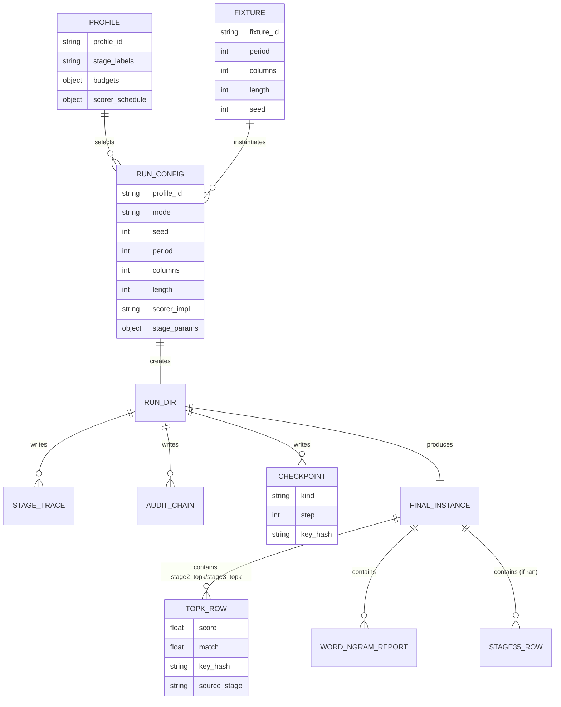

# Strategic plan to scale the no‑WLI periodic substitution+transposition campaign in RDP

## Executive summary

The campaign has demonstrated **credible partial solve capability** on the current hard anchor (`p9 / c3 / l1000 / no‑WLI`) with **best observed match ≈0.77** and multiple runs in the **0.76–0.77** band (from the attached review pack’s “best evidence” inventory and catalog extracts). That is an important proof‑of‑life: it shows the pipeline can reach genuinely informative basins rather than only noise.

However, the same evidence set also shows a **large regression in basin strength upstream of any late rescue**: Stage‑3 top‑k candidates dropped from a historical cluster around **≈0.77 top‑k mean** to a **≈0.64 top‑k mean** in a newer bounded proof run, even though the newer run spent **more Stage‑3 evaluations**. In practical terms: **you are currently paying more compute to get a worse basin**, and Stage‑3.5 cannot compensate for that. This aligns with—and is explicitly stated by—the basin regression report: the best single lever right now is to **restore (and then improve) Stage‑3 basin generation**, not to keep adding late‑stage gadgets.

Separately, the Stage‑3.5 “proof attempt” in the pack is **invalid as a proof**: the run configuration requested Stage‑3.5, but the final artifact reports Stage‑3.5 configuration effective = 0 and Stage‑3.5 ran = 0 (your solve‑integrity plan calls this out). That is fixable, but it must be fixed as part of the “reliable methodology” work (contract‑based plumbing, trace/audit, determinism), not as another tuning knob.

The harder goal jumps (`p13 / l1000` reliable full solve; then `p13 / l500` reliable partial solve 0.60–0.70 with coherent chunks) are **not incremental**. They demand (a) **stronger global search** and (b) **stronger priors** than short‑window n‑gram scoring alone, because at `p=13` the effective data per phase of the period is small, and the problem becomes information‑limited without richer language constraints. This is consistent with how the classical literature frames the limits of stochastic optimisation attacks against transposition/substitution families: success depends heavily on ciphertext length relative to the transformation scale, and even “failed” runs are often only useful as *clues* rather than complete recoveries. citeturn1search8

The plan below therefore prioritises:

1) **Methodology hardening and basin recovery** (restore old basin; prove the pipeline is doing what it claims; prevent silent non‑execution of requested stages).

2) **Targeted algorithm upgrades** that are specifically chosen to unlock `p11–p13` rather than just make `p9/c3` nicer: multi‑fidelity search, stronger structured moves, population methods (parallel tempering / CE‑style), and reranking with longer‑context language models.

3) **A benchmark ladder and acceptance metrics** that explicitly measure “reliable” and “real partial solve” in a way that avoids overfitting to one family.

## Baseline capability and reproducibility

The attached review pack provides three kinds of baseline evidence that matter to a strategic plan:

- **Best‑case capability**: historical `p9/c3/l1000` partial solves reaching ≈0.77 match (best ≈0.773), which the pack treats as the canonical best evidence.

- **Distributional reality**: across the catalog’s hard fixture runs, the median best match is materially lower than the best and only a small fraction exceed 0.70 in the current archive. This supports your own framing: you have genuine partial solutions—but **not** “more often than not” at the high end yet.

- **Diagnostic attribution**: the basin regression report and selector ladder audit isolate likely causes: the main regression is **Stage‑3 basin generation**, while selector/scorer ordering is “useful but imperfect” (i.e., there is regret, but it is not consistent with a totally broken scorer). That’s consistent with a system that still has a workable signal but is failing to exploit it reliably.

In methodological terms, your infrastructure is already heading in the correct direction: deterministic run guards, cross‑backend parity tests, stage traces, and an audit‑chain mechanism are all the right ingredients for answering expensive questions with confidence about what actually happened. The “audit chain” pattern is particularly valuable because it allows you to detect tampering or silent drift in iteration outputs by chaining hashes per line/row, which is a standard integrity technique for append‑only logs. (Your codebase implements this internally; conceptually similar techniques are widely used in logging/audit systems.)

Where reproducibility still needs tightening is not “general engineering mess”; it is a **small number of contract‑critical control points**:

- **Profile → runtime state plumbing**: a requested stage must either run or emit an unambiguous, machine‑checkable reason why it did not run (and this reason must be asserted in tests).

- **Stage‑3/Phase‑C/Stage‑3.5 semantics split**: the distinction between *search scorer* and *judge scorer*, and between Phase‑A endpoints and Phase‑B seeds, must remain explicit because confusions here lead to incorrect conclusions (this mirrors the warning style of your own benchmark contract files).

- **Budget observability**: for laptop‑anchored work, evaluation counts and wall‑clock time must be first‑class metrics. Feature work that increases eval cost without increasing basin quality is a net negative (your basin regression summary already flags a case where more evals produced a worse basin).

From here onward, every “hard” experiment should be framed as: **fixed fixture(s), fixed initialisation and seeds, fixed budget, one variable changed**, and a mandatory contract artifact set (run_config, stage_specs, policy_spec, trace, audit chain, and final instance). This is precisely how you prevent chasing ghosts when runs are expensive.

## What the problem demands at p13/1000 and p13/500

There are two distinct difficulties as you move to `p13` and shorter text.

First, the **search space grows explosively** with period because the unknown mapping is effectively a structured permutation object per position in the period. For polyalphabetic/periodic substitution, each phase has fewer samples as period increases, so purely frequency‑driven signals weaken quickly.

Second, at shorter lengths (e.g. `l=500`), even a good stochastic optimiser may have insufficient signal to uniquely identify keys; instead it returns **partially correct structure** that can be leveraged into readable chunks. This is exactly what the simulated‑annealing transposition literature reports: there is a “ratio” regime where full recovery fails but the output still carries exploitable hints. citeturn1search8

These two pressures are why “just tune Stage‑3 longer” is unlikely to be the long‑term answer. To move beyond `p9` toward `p13`, you generally need at least one of:

- **Better priors** (language models that capture longer‑range constraints than short n‑grams), because long‑range statistical structure is what makes natural language compressible and predictable. citeturn7search3

- **Better global search** (methods that avoid collapsing into a single local basin too early), such as MCMC/annealing variants with controlled acceptance, parallel tempering, or population search.

- **Better structured moves / decompositions** that reduce effective branching (e.g., solve part of the structure “almost exactly” while searching another part, or use segment transforms that match the cipher structure).

This is not speculative: it is aligned with the trajectory seen across published work on classical cipher attacks:

- For substitution, algorithms like entity["people","Thomas Jakobsen","cryptologia author 1995"]’s method are explicitly about making local improvements efficiently from a seed guess. citeturn1search0

- For substitution and substitution‑transposition combinations, MCMC approaches are an established family; work continues on improving their effectiveness (even down to RNG choices and proposal mechanics). citeturn4search4turn1search3

- For transposition families, stochastic global optimisation (simulated annealing) is a canonical approach, again with explicit dependence on ciphertext length and with “clue value” in imperfect outputs. citeturn1search8

### Visual orientation

image_group{"layout":"carousel","aspect_ratio":"16:9","query":["columnar transposition cipher diagram","polyalphabetic substitution cipher period diagram","simulated annealing cryptanalysis diagram","Markov chain Monte Carlo substitution cipher diagram"],"num_per_query":1}

The key implication for your stated goals is: **p13/1000 reliable full solve is primarily a basin + prior problem; p13/500 useful partial is primarily a prior + explainability problem** (getting coherent chunks reliably, even when full key recovery is ambiguous).

## Scorers and data signals

### Scorer families and parity

RDP already has an explicit design intent of supporting multiple scoring backends and implementations (NumPy, Torch, and a unified façade). Cross‑backend parity tests (including CPU↔CUDA parity for some telemetry and order‑parity constraints under non‑tiny deltas) are a major strategic advantage: they allow you to pursue GPU acceleration without turning the project into “it solved once on my machine” folklore.

That said, parity is only one half of the scorer story. The other half is **fitness shaping**: at `p13`, small changes in scoring can change the basin landscape radically.

The wider literature supports a cautious approach here:

- N‑gram methods can work well, but their behaviour depends on `m` and on how the likelihood is defined; some work argues why certain gram sizes dominate empirically in substitution breaking. citeturn1search2

- MCMC methods for substitution ciphers often use a bigram transition matrix derived from a large corpus as the likelihood. entity["people","Persi Diaconis","stanford statistician"] describes this explicitly in his cryptography example: build a transition matrix from a large text and use it as a plausibility score for a permutation mapping. citeturn5search30

Your current internal split between *search scorer* (fast, smoother) and *judge/aux scorers* (more discriminative, sometimes discontinuous like span/hamming gates) is exactly the right pattern. It is a classic “multi‑fidelity” approach: use cheap approximations to explore, then expensive or brittle signals to select. The mistake to avoid is letting discontinuous signals dominate early search, where they tend to create false walls and score plateaus.

### Data usage improvements aligned to no‑WLI

Because WLI is intentionally absent, “word signals” must be treated as *latent* rather than explicit. Three practical data‑usage directions are likely to pay off more than raw tuning:

**Latent word/phrase evidence as a late judge, not an early objective.**  
Span/hamming and word‑ngram signals are most valuable when they confirm that a candidate plaintext is entering the “human‑readable” regime—i.e., when you already have a decent basin. This is consistent with the simulated annealing “clue” viewpoint in transposition work. citeturn1search8

**Crib/keyword plumbing as decisive, not decorative.**  
You correctly note that “chasing perfection in an automatic tool is a fool’s errand”; therefore “human would be happy” readability is the right stop condition. Cribs and keyword checks are a direct way to formalise that. The statistical literature already uses such “side information” in practical cryptanalysis; even the MCMC substitution example reports that good initialisation (frequency‑based rather than random) materially affects success rate. citeturn4search6turn5search30  
Concretely: you want a *crib subsystem* that can (a) bias seeding and (b) act as a hard accept criterion or tie‑break in the final selection of candidates.

**Longer‑context language models for reranking.**  
What makes short ciphertext hard is the lack of evidence per structural degree of freedom. Longer‑context models exploit redundancy extending well beyond 10–20 characters; this is precisely what entity["people","Claude Shannon","information theory founder"] quantified: long‑range constraints in English reduce entropy relative to short‑range models. citeturn7search3  
Practically, this argues for introducing a **character‑level neural LM reranker** (or a very fast higher‑order n‑gram model) for the late ranking of Stage‑3 top‑k and Stage‑3.5 archive rows. For efficiency, you can use a compact, fast n‑gram engine like KenLM for high‑throughput LM queries. citeturn7search2

A note on “LLMs”: you do not need a huge general model to gain leverage here; you need a model that matches your preprocessing (alphabet, casing, punctuation handling, and no‑WLI text) and produces stable log‑likelihoods quickly. If you do experiment with transformer LMs, because they are general sequence predictors, they can serve as a reranker/critic. citeturn7search8turn7search7

## Solver and search strategy lifts

### What is already aligned

Your current staged structure (A/B/C with Stage‑3 two‑phase and Phase‑C rescue; optional Stage‑3.5 frozen‑tail substitution solver) is broadly aligned with how successful classical attacks tend to work:

- Use **many seeds / restarts**.
- Use **local improvement** moves that match cipher structure (swap within substitution blocks; occasional transposition moves).
- Use **multi‑fidelity scoring** (cheap objective for exploration; richer judge for selection).
- Use **rescue mechanisms** that exploit partial structure once near readability.

This matches the spirit of Jakobsen‑style iterative refinement for substitution. citeturn1search0  
It also matches the “stochastic global optimisation” framing for transposition. citeturn1search8

### Where you are likely bottlenecked

Given the pack’s own regression analysis, the main bottleneck is not “general untidiness”; it is **basin quality in Stage‑3**, i.e. how effectively the search finds promising regions of key space for deep refinement. This is exactly where global‑search methods and better structured moves matter.

The research literature suggests several method families that are plausible upgrades for your setting:

- **MCMC / simulated annealing for substitution‑transposition**: explicitly used in published substitution‑transposition cryptanalysis and has known extensions/improvements. citeturn4search4turn1search3turn5search30

- **Two‑phase hill climbing with specialised transforms for columnar transposition** (even with long keys): Lasry et al. describe a two‑phase approach with a two‑dimensional fitness score and special transformations on key segments, which is directly relevant to the idea of “stronger column moves than random swaps”. citeturn6search2

- **Population / cross‑entropy methods**: the cross‑entropy method is a general approach to combinatorial optimisation and can act as a structured, sample‑efficient alternative to naïve random restarts. citeturn2search1

- **MCTS/UCT for hierarchical decompositions**: MCTS combines sampling with tree search and is especially useful when you can define rollouts and need to manage a large branching factor. citeturn2search7turn3search0  
In this setting, MCTS is most plausible when applied to a *decomposition* (e.g., build a transposition structure or a partial period alignment progressively, with rollouts using your existing substitution solver).

- **Constraint programming / ILP for subproblems**: modern CP‑SAT solvers are effective for integer‑constraint subproblems. citeturn7search0  
For ciphertext‑only, you are unlikely to encode the full problem as CP‑SAT at `p13`, but CP‑SAT can still be valuable for *restricted subproblems* (e.g., selecting among near‑equivalent candidate swaps/segments under constraints, or optimising an alignment/route component in a reduced model).

### Candidate method comparison table

The table below intentionally mixes “recover what you had” (because it is the fastest path to real capability) with “add fundamentally new leverage” (because `p13` likely needs it).

| Candidate method family | Core idea | Complexity | Integration effort in RDP | Expected benefit vs current | Main risks / failure modes |
|---|---|---:|---:|---|---|
| Stage‑3 basin recovery A/B (restore old config/logic) | Reproduce the historical basin; isolate the regression; lock it as a baseline | Low | Low | Very high near‑term (restores ≈0.77‑class basins) | Time spent if regression is multi‑factor; temptation to “fix by accident” without root cause |
| Stage‑3.5 plumbing + proof contracts | Make Stage‑3.5 execution and non‑execution explicit, testable, and audited | Low–Med | Low–Med | High for methodology; medium for solving | Doesn’t increase capability if basin is still weak |
| Structured move set upgrades (segment transforms, block‑aware multi‑swaps) | Replace “random swap” bias with moves aligned to cipher structure | Med | Med | Medium–high (better basin exploration, fewer wasted evals) | More knobs; can overfit; can break determinism if not careful |
| Simulated annealing / MH acceptance + parallel tempering | Controlled acceptance to escape local maxima; multiple temperatures exchange | Med–High | Med–High | High for `p11–p13` exploration | More compute; difficult tuning; can degrade if LM score too noisy |
| Cross‑entropy / population search over structured keys | Maintain a distribution over moves/keys; update from elites | High | High | Potentially high (sample efficiency) | Implementation heavy; can collapse without good featureisation |
| MCTS/UCT on a decomposition (e.g., transposition/route layer) | Tree search over partial structure with rollouts via existing solver | High | High | Potentially high when decomposition is clean | Hard to define good rollouts; risk of huge branching without pruning |
| Neural character‑LM reranker (late only) | Use a longer‑context model to pick among top candidates/chunks | Med | Med | High for `l=500` partial readability; medium for `l=1000` | Miscalibration; throughput cost; risk of model mismatch to corpus |
| KenLM‑backed high‑order char/word LM for judge/tie‑break | Fast high‑order LM scoring for candidate ranking | Med | Med | Medium (stronger discrimination, low latency) | Overfitting to corpus; may reward “plausible gibberish” unless anchored |
| Crib/keyword and dictionary‑span gates (late, explicit) | Turn “human would be happy” into explicit acceptance criteria | Low–Med | Med | Medium for partial solves; high for recoveries from near‑solutions | Can bias towards false positives; must be used carefully and audited |
| CP‑SAT subproblem optimiser | Solve constrained subproblems exactly/near‑exactly | Med–High | Med | Medium in narrow spots (alignment/route/segment choice) | Modelling risk; can be slow; may not generalise |

## Experimental roadmap and benchmark acceptance metrics

### Definitions that make “reliable” and “real partial solve” testable

To avoid drifting goals and overfitting, the project needs explicit acceptance metrics beyond “best match ratio once”.

**Full solve (for `p13/l1000`)**
- Character match ratio = **1.000** against truth plaintext.
- Key‑equivalence check passes (allowing for any known symmetric/key‑normalisation equivalences).
- Achieved under a fixed budget (see below) on a fixed small‑laptop profile, and reproduced across seeds.

**Real partial solve (for `p13/l500`)**
- Character match ratio ≥ **0.60** (stretch target ≥0.70).
- At least **N readable chunks**: e.g., ≥3 contiguous correct segments of length ≥40 (or an equivalent “chunk coverage” metric such as ≥25% of text covered by segments ≥30).
- “Human‑happy” gate: at least one dictionary/keyword/crib criterion passes (configurable per benchmark family), and the acceptance path is traceable (which signals triggered, where).

**Reliable**
- For a tier/fixture family, success in **≥70% of seeds** under the fixed budget, with no manual picking among many runs.
- Report both mean and worst‑case behaviour (not just best‑of‑campaign).

These metrics align with the reality highlighted in the classical literature: partial outputs can be valuable and should be measured as such, not dismissed as failure. citeturn1search8

### Suggested benchmark suite

A healthier ladder should include both controls and hard targets, and it should explicitly test generalisation across period, columns, and length.

- **Easy controls** (must be ≥99% solved quickly; used to detect regressions): `p5` and `p7` families at `l1000`.
- **Medium controls** (should become reliably solvable before you declare `p11–p13` readiness): `p9` with “easier” column settings at `l1000`, plus at least one `l500` variant to force short‑text behaviour.
- **Hard anchor**: current `p9/c3/l1000` hard target (because it is your best evidenced basin‑reaching case).
- **Stretch diagnostics** (not yet the main scorecard, but tracked continuously): `p11/l1000`, `p13/l1000`, and `p9/l500`.

This structure reduces the risk of overfitting: if a change “improves” the hard anchor but breaks easy controls or medium controls, it is not a real capability gain.

### Prioritised roadmap with budgets and success criteria

Budgets are expressed as “small‑laptop wall‑clock” and “evaluation ceiling”, because your internal logs already treat evaluation counts as the honest measure of how much search you are doing.

**Phase zero: lock down methodology (days to a week)**  
Goal: any claimed improvement is reproducible and auditable.

- **Fix Stage‑3.5 execution plumbing** so “requested enabled” cannot silently become “effective disabled”. Success = Stage‑3.5 runs when enabled and emits a trace row; when it cannot run, a deterministic reason is written and asserted in tests.
- **Add a “contract sentinel” test**: for a minimal fixture and profile, verify that the stage‑engine state includes Stage‑3.5 flags and that final artifacts reflect them.
- **Standardise run artifact bundles**: run_config + stage_specs + policy_spec + trace + audit chain + final instance, required for every “hard” run.

Budget: trivial; success criteria are binary.

**Phase one: basin recovery (one to two weeks)**  
Goal: restore historical Stage‑3 basin quality for the hard anchor under fixed budgets.

- Run a strict A/B between “old reference configuration” and “current branch configuration” on the same fixture+seed and equalised budgets.
- Success = Stage‑3 top‑k mean returns to the historical band (≈0.75+) and best match returns to ≈0.76–0.77 under the same evaluation ceiling.

Budget: 1–2 overnight runs. Payoff: very high.

**Phase two: structured‑move upgrades (two to four weeks)**  
Goal: improve basin reach and reduce variance (“more often than not”).

Experiments (each run on the fixed hard anchor + at least one medium control):

- Add **segment‑level column moves** inspired by two‑phase hill climbing approaches (e.g., swap/rotate segments rather than only point swaps), with minimal new knobs. This draws directly on published transposition cryptanalysis ideas. citeturn6search2
- Add **annealed acceptance** (temperature schedule) for a *subset* of the search (e.g., Phase‑A only or Stage‑1 scout only), to reduce early collapse.
- Add **diversity maintenance** in pools/archives: keep “different” candidates (by key‑hash or substitution‑Hamming distance), not only the top score.

Success criteria:
- On `p9/c3/l1000`, ≥70% of seeds exceed 0.60 match under the fixed budget, and ≥20% exceed 0.70 (these thresholds should be tuned to your ambition, but the idea is to track reliability curves).
- Controls must not regress.

Budget: 5–10 nightly runs total across small set of seeds.

**Phase three: stronger priors for `p11–p13` (one to two months)**  
Goal: push beyond current ceilings by adding longer‑context discrimination.

- Integrate **KenLM‑style** high‑order char/word LM scoring into judge/tie‑break paths (Stage‑3 top‑k ranking, Phase‑C selection, Stage‑3.5 archive). citeturn7search2
- Add a **compact neural character LM reranker** as an optional judge (late only). Shannon’s analysis makes clear why longer‑range constraints matter; neural LMs are one pragmatic realisation of that. citeturn7search3turn7search8
- Introduce **crib/keyword plumbing** as explicit hooks in selection (not as offline inspection). The MCMC substitution narrative shows how much initialisation and plausibility scores matter; cribs are a high‑signal plausibility check when truth is unavailable. citeturn5search30turn4search6

Success criteria:
- `p11/l1000`: best‑of‑N moves into ≥0.50 routinely, then ≥0.60.
- `p13/l1000`: clear upward trend in basin quality and partial solves; full solves may still be rare at this stage.
- Crucially: improvements should also move `p9/l500` upward, because that is the same “short‑text” regime you ultimately care about.

Budget: 1–2 weeks of nightly runs with fixed seeds; plus offline rerank profiling.

**Phase four: global search upgrades for `p13/l500` (two to three months)**  
Goal: make “useful partial” reliable in the information‑limited regime.

- Implement **parallel tempering** (multiple chains at different temperatures exchanging states) for periodic structured keys (block + occasional column moves). This is a well‑understood way to improve exploration in rugged landscapes. citeturn4search5turn4search4
- Prototype **MCTS/UCT** on a decomposition where branching is manageable and rollouts are fast (e.g., route/column structure while substitution is locally optimised in rollouts). MCTS/UCT is designed to manage exploration/exploitation trade‑offs in large decision spaces. citeturn2search7turn3search0
- Use **CP‑SAT** selectively for tightly constrained subproblems (e.g., alignment selection, segment assignment), where an exact optimiser can replace heuristic guesswork. citeturn7search0

Success criteria:
- `p13/l500`: ≥70% of seeds achieve ≥0.60 match *or* meet the “readable chunk” criteria under fixed budgets.
- Each success must carry an auditable acceptance path (which signals fired).

Budget: heavier; expected to require careful profiling and parallelism.

### Mermaid diagrams

Pipeline / stage flow (with Stage‑3 two‑phase, Phase‑C, Stage‑3.5):  

```mermaid
flowchart TD
    A[Fixture instance\n(period, columns, length, seed)] --> B[Gate-0 checks\nroundtrip, oracle sanity]
    B --> C[Stage A discovery\nsubstitution scouting\nmany seeds/restarts]
    C --> D[Stage B promotion\narchive + rerank\npool diversity]
    D --> E[Stage C refine\njoint search\nKaeding-style]
    E --> F[Stage-3 Phase A\nshort refine\nbasin formation]
    F --> G[Basin judge\n(span/word auxiliaries)\nselect top-N seeds]
    G --> H[Stage-3 Phase B\ndeep refine\ncol moves + slips]
    H --> I{Phase-C enabled?}
    I -- yes --> J[Phase-C rescue\nslice/local mini-search\nlexical tie-breaks]
    I -- no --> K[Stage-3 complete]
    J --> K
    K --> L{Stage-3.5 enabled?}
    L -- yes --> M[Stage-3.5 frozen-columns\nsubstitution-only follow-up\narchive + beam]
    L -- no --> N[Final selection]
    M --> N
    N --> O[Final instance artifact\nbest key, best plaintext,\ntruth diagnostics]
    C -.-> T[Stage trace JSONL]
    D -.-> T
    E -.-> T
    N -.-> U[Iteration audit hash-chain]
```

Entity–relationship chart for core artefacts (profiles, fixtures, archives, checkpoints):  



## Confidence, risks, and unknowns

### What looks fundamentally promising

The project is **promising but not yet robust**.

Promising because:

- The system has already reached meaningful partial decryptions on a hard anchor, which is rarely possible without a genuine signal.
- The architecture includes many of the methodological primitives needed for serious progress (multi‑backend scorer parity, deterministic tests, trace/audit outputs, staged search, and explicit contracts).
- The staged and multi‑fidelity shape is aligned with known effective patterns in classical cryptanalysis (Jakobsen‑style refinement; simulated annealing and MCMC families; late‑stage clue exploitation). citeturn1search0turn1search8turn4search4turn5search30

### Biggest strategic risks

- **Basin fragility and compute waste**: If basin quality is unstable across branches/configurations, you will keep paying for runs that cannot possibly reach higher‑period targets. Treat basin recovery as a first‑class objective, not a nice‑to‑have.

- **Overfitting to one hard family**: Improvements that only move `p9/c3/l1000` but do not generalise to medium controls and short‑text variants are likely to be “lucky alignment” rather than real capability. A ladder with stable controls is the antidote.

- **Signal mismatch at `p13/l500`**: Without stronger priors, you may hit a ceiling where many keys look similarly plausible under short‑window scores. Shannon’s long‑range redundancy argument is a strong indicator that longer‑context modelling is the right axis to explore. citeturn7search3

### Missing or uncertain items that limit certainty

- The provided repo snapshot is intentionally “no‑bloat” and appears to elide some implementation details (e.g., portions of cipher mechanics) and does not include all heavy assets (language model data, etc.). That limits the ability to reason about some low‑level behaviour without the full repository and asset set.

- Hardware/time: the pack contains evaluation counts and configuration budgets, but the plan’s wall‑clock estimates remain **approximate** without consistent timing logs on the target “half‑decent laptop” platform.

- External validity: it is still unclear (from the limited `p11–p13` evidence in the pack) whether the current signals scale smoothly with period, or whether there is a qualitative phase change around `p≈11–13` that requires a different decomposition. This is precisely why the roadmap includes explicit medium controls and short‑text diagnostics.

### What to stop doing

Until basin recovery and methodology hardening are complete:

- Stop treating new late‑stage features as progress if Stage‑3 top‑k basin quality is still regressed.
- Stop adding new knobs that cannot be traced and asserted in contracts/tests.
- Stop running long expensive jobs that do not answer a sharply specified question with an A/B comparison and success criteria.

Once you have the old basin restored under contract, you will be in a position to invest confidently in the harder, higher‑leverage upgrades (long‑context scorers, parallel tempering, population methods, and hierarchical search).