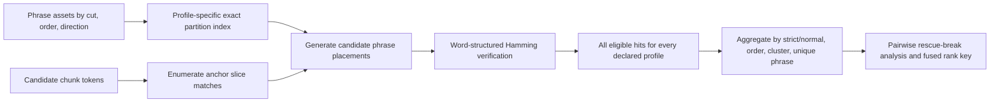
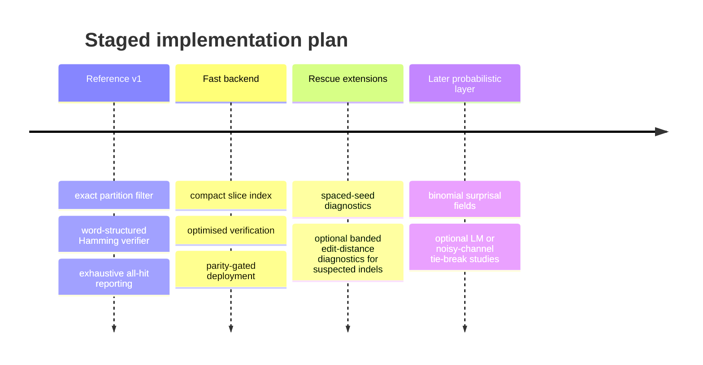

# Designing a Production-Safe Phrase-Coherence Scorer for Damaged No-Space Candidate Text

## Executive summary

For the setting you describe, the most robust pragmatic second-stage scorer is a **word-structured phrase-Hamming verifier** built around **explicit profile families**, **exact candidate generation**, and **positive-support aggregation**. That recommendation follows directly from the project constraints: candidate text is a flat token stream with no separators, phrase identity must remain tied to structured `word_token_ids`, the alphabet is small, corruption is materially high, and the scorer must count **all** eligible hits deterministically without top-k pruning, silent dropping, or silent fallback. In the approximate-string-matching literature, the practical pattern that repeatedly wins is **filter, then verify exactly**; filters are useful for speed, but the production-safe signal comes from the verified hit set, not from the filter itself. fileciteturn0file0 citeturn25view1turn6view0turn30view0

That makes **word-structured per-word Hamming** the right v1 model. It preserves boundary-sensitive phrase identity, exposes the right debugging fields (`word_hds`, `total_phrase_hd`, `max_word_hd`, `normalised_phrase_hd`), and naturally extends a first-stage word/span-Hamming layer. By contrast, **joined-phrase Hamming** loses the boundary information you explicitly want to preserve; **edit distance** introduces alignment freedom that is only justified if you have real evidence of insertions, deletions, or transpositions in the channel; **q-gram** and **spaced-seed** methods are valuable as infrastructure or rescue mechanisms, but not as the primary score; and **noisy-channel**, **language-model**, and **WFST** approaches are real options for later tie-breaking or unification, not the safest central scoring rule for a first deterministic deployment. fileciteturn0file0 citeturn9view0turn6view1turn6view0turn21view2turn20view0turn20view1turn21view0turn21view1turn35view0turn34search0

Thresholds should be **explicit, capped, and profile-based**, not scaled linearly with nominal corruption. The critical distinction is between **coverage evidence** and **high-confidence support evidence**. A short damaged island such as length 7 with HD ≤ 2 is still plausible over a wide damage range, but a long phrase such as length 18 with HD ≤ 2 rapidly becomes rare as corruption rises: under a simple independent substitution model, the probability of length 18 suffering at most two mismatches is about 27% at 20% damage, 6% at 30%, 0.8% at 40%, and 0.07% at 50%. By comparison, length 7 with HD ≤ 2 remains much more available. So **length-18/HD2 evidence is excellent when it appears, but it should be treated as high-precision support, not the central detector**, especially at 40–50% corruption. citeturn28calculator0turn28calculator1turn28calculator2turn28calculator3turn29calculator0turn29calculator1turn29calculator2turn29calculator3

My concrete recommendation is therefore: implement a v1 system that keeps **strict** and **normal** phrase assets separate; treats **3-grams as the central order**, **4-grams as high-precision confirmation**, **2-grams as auxiliary coverage**, and **5-grams as diagnostic only**; uses **explicit Hamming profiles** with both **total-HD** and **max-word-HD** gates; scores this layer as **positive support only**; and integrates it with the existing word/span scorer via a **tiered lexicographic or bounded-override fusion**, not an unbounded additive sum and not a fitted model. fileciteturn0file0

## Problem framing and assumptions

The project materials define a very specific problem. Candidate text arrives as a **flat token stream** with **no explicit word separators**; phrase assets already have structured word information, including `word_token_ids`, flattened `rune_token_ids`, and per-word `rune_lengths`; the alphabet is described as **small, roughly 29 symbols**; corruption in scope is **20% to 50%**; and the existing first-stage word/span-Hamming layer already finds some real local word-like evidence, but that local evidence is not safe enough on its own because bad candidates can still contain isolated plausible fragments. The missing layer is therefore not “find words” again, but “decide whether word-like spans align into plausible ordered phrase evidence”. fileciteturn0file0

The input to the phrase scorer is therefore best understood as **candidate offsets in a no-space token stream**, evaluated against **structured n-gram phrase assets with known word lengths**. The scorer’s job is not to replace the word layer and not to build a full language model over the whole candidate. Its job is to add **deterministic phrase-coherence support**: does a candidate contain adjacent spans of the right lengths that match plausible multiword phrases in the correct order, with damage levels compatible with the declared profile? That is also why the project’s identity rule matters so much: phrase identity must stay on `word_token_ids`; `rune_token_ids` are only a flattened compatibility representation; and different segmentations must **not** be collapsed merely because their joined token stream is the same. fileciteturn0file0

I therefore assume the following throughout the report. The alphabet size is **not formally fixed in the request**, but the project materials say it is roughly 29 symbols, so I treat it as a **small-alphabet regime** and avoid methods whose false-positive behaviour depends on large-alphabet sparsity. I assume the dominant first-pass corruption model is **substitution-like**, because the current proposal is Hamming-based and phrase windows are length-fixed; where insertions and deletions may matter, I treat them as a possible later extension rather than the default design basis. I also assume that the main operational objective is **ranking stability and support precision on hard pairs**, not end-to-end generation of the best clean text. fileciteturn0file0

Those assumptions strongly favour a scorer that is transparent, exact, easy to validate in Python, and easy to re-implement independently in a faster backend without changing semantics. That rules out a large class of brittle-but-clever scoring schemes and points toward a conservative architecture: exact candidate generation, exact verification, explicit profile manifests, complete accounting of all eligible hits, and per-hit fields that can be inspected in pair-level rescues and breaks. fileciteturn0file0

## Literature map and method comparison

### Practical lessons from approximate string matching

The approximate-string-matching literature gives a very consistent engineering lesson. Navarro’s survey organises the field into dynamic programming, automata, bit-parallelism, and filtering; he also notes that in practice the **fastest algorithms combine a fast filter with a non-filter verifier**, and that filtering methods are fast but limited by the error regime and still require exact checking of candidate matches. That is exactly the shape your problem wants: not a single magical score, but a safe verifier wrapped in a lossless or near-lossless candidate generator. citeturn25view2turn25view1

The Stanford Information Retrieval text makes the same point in a more application-oriented way. It shows how **k-gram indexes** can be used to enumerate a manageable candidate set and then **verify with edit distance**, and it warns that naïve overlap counts alone produce implausible candidates unless the overlap measure is controlled carefully. In other words, q-grams are good infrastructure, not enough by themselves to establish semantic or structural coherence. citeturn6view0turn6view1

That matters here because your scorer is not operating on generic text search, but on a small-alphabet no-space stream where accidental local overlap is more likely than in ordinary orthographic text. The project therefore needs a verifier with **structural constraints**. Word-structured Hamming gives exactly that: equal-length, boundary-respecting, adjacent-word comparison, with no alignment freedom. Edit distance does the opposite: it opens an alignment search space whose benefits are real only if insertions or deletions are truly part of the corruption channel. The Stanford IR text explicitly notes that weighted edit costs can be effective when the likelihood of different edits is known, but it also makes clear that ordinary edit distance is a dynamic-programming problem with quadratic dependence on pattern lengths. citeturn6view1turn9view0

A final practical lesson comes from exact indexing for small mismatch counts. The split-index work of Cisłak and Grabowski is directly relevant because it uses the **Dirichlet principle** for few-mismatch matching and reports competitive space-time trade-offs, especially for Hamming distance. That points to a production-safe design pattern for your v1: use **exact partitions implied by the allowed Hamming threshold** to generate candidate phrase placements, then verify them with the structured Hamming scorer. citeturn30view0

### Practical lessons from language modelling, noisy channels, and automata

The language-modelling literature is useful here, but mostly to define what **not** to do too early. Chen and Goodman showed long ago that smoothing choices materially affect n-gram cross-entropy, and Goodman later showed that interactions among higher-order n-grams, skipping, interpolated Kneser–Ney, and clustering are substantial. Later skip-n-gram work shows further perplexity gains, particularly under sparse data. The practical implication is straightforward: if you later add phrase-frequency or contextual priors, you should not use raw counts naïvely. You will need a proper smoothed LM, and if you care about skipped contexts the interpolation scheme matters. That is a later-stage ranking prior, not a replacement for a deterministic coherence verifier. citeturn21view0turn21view1turn35view0

The IR spelling-correction chapter adds an especially relevant operational lesson. When exploring phrase alternatives, it recommends keeping only the **most frequent combinations** in the collection or query logs, because enumerating all locally plausible substitutions leads to a combinatorial explosion. That is directly analogous to your concern that isolated plausible word fragments are not safe enough. Collection-level n-gram statistics are indeed useful — but primarily as a **prior or trimming heuristic** after locality has been established, not as the core evidence that a damaged phrase is present. citeturn6view2

Noisy-channel models are theoretically attractive because they factor the problem into a prior over phrases and an error model over corruptions. That is precisely why they are so successful in spelling correction and speech recognition. But the model only earns its keep when the channel is known well enough that \(P(\text{observed}\mid\text{phrase})\) is meaningfully richer than a monotone transform of mismatch counts. In your setting, the actual corruption process is not specified beyond being severe; absent a fitted substitution/indel confusion model, a simple noisy-channel score usually reduces to “phrase frequency plus distance”. That is not bad, but it is not a reason to skip the explicit Hamming verifier. citeturn34search0turn6view1

Weighted finite-state automata and transducers matter for a different reason. Pereira and Riley, and later Mohri, Pereira, and Riley, show that weighted automata are a strong unifying framework for dictionaries, language models, and weighted composition. If later versions of the system need a single formalism for exact phrase lexica, cost models, and regular constraints, WFSTs are highly relevant. But for a first deployment whose central priorities are a simple Python reference, exact all-hit accounting, boundary-sensitive phrase identity, and no silent fallback, that machinery is **architecturally plausible but strategically premature**. citeturn20view0turn20view1

### Method comparison

The table below synthesises the approximate-matching, k-gram, seed-sensitivity, language-modelling, noisy-channel, and WFST literature together with the project’s specific boundary and determinism constraints. fileciteturn0file0 citeturn25view1turn6view0turn21view2turn21view0turn35view0turn20view0turn20view1turn34search0

| Method | Main strength in this system | Main weakness or false-positive mode | Behaviour across 20/30/40/50% corruption | Compute profile | Verdict |
|---|---|---|---|---|---|
| **Word-structured per-word Hamming** | Preserves word boundaries, exposes per-word diagnostics, deterministic, easy to verify exactly | False positives if thresholds too loose on short/common phrases; can miss indel corruption | Strong at 20–30%; still useful at 40%; coverage drops at 50% but high-precision hits remain valuable | Cheap linear-time verification per candidate phrase placement | **Implement first** |
| **Joined-phrase Hamming** | Same flattened total-HD cost as a simple whole-phrase check | Violates boundary-sensitive identity rule; hides whether one word is badly damaged; collapses structured distinctions | Similar raw recall to total-HD, but lower precision and worse explainability at every damage level | Cheap | **Do not use as primary score** |
| **Edit distance** | Handles insertions/deletions/transpositions if those truly occur | Alignment freedom can invent coherence; costlier; boundary slips become hard to interpret | Potentially helps if real indels are common; otherwise mostly adds noise | Quadratic DP unless carefully banded/bit-parallel | **Defer; use only if channel evidence demands it** |
| **q-gram filter + verify** | Very useful to cut candidate set before exact verification | On a small alphabet, short q-grams collide; longer q-grams become brittle under high damage | Good infrastructure at 20–30%; still helpful with careful q at 40%; poor as a direct score at 50% | Excellent as filter, incomplete as evidence | **Use as filter, not central score** |
| **Spaced seeds / skip-grams / gapped evidence** | Improves recall under substitutions and sparse data; good rescue tool | Raw gapped hits can be noisy in small alphabets; still requires verification | Helpful rescue at 40–50%; less necessary centrally at 20–30% | Good filtering, moderate engineering complexity | **Diagnostic or rescue layer only** |
| **Noisy-channel scoring** | Principled combination of prior and corruption model | Needs a trustworthy error model; otherwise mostly re-encodes distance + counts | Potential later tie-breaker across all tiers; not safest v1 centre | Moderate runtime, high modelling burden | **Defer or use diagnostically** |
| **n-gram LM likelihoods** | Captures contextual prior and phrase commonness | Needs smoothing; penalises rare valid phrases; can reward banal frequent phrases | Useful as a later prior in cleaner regimes; weak central evidence at 40–50% | Cheap once model built, but data and smoothing matter | **Tie-breaker only** |
| **Weighted automata / WFST** | Elegant framework for combining lexica, priors, and costs | Heavy abstraction and implementation overhead for a first deployment | Not a direct answer to corruption robustness by itself | Compile-time and engineering heavy | **Relevant later, not for v1** |

The most important conclusion from that comparison is that **only one method cleanly matches all of your first-release requirements at once**: word-structured Hamming, wrapped in exact candidate generation. Everything else is either a useful helper, a future extension, or a different product.

## Thresholding, null models, and score design

### Fixed thresholds versus length-scaled and probabilistic thresholds

The right answer here is a **hybrid**, but not the kind of hybrid that replaces the explicit profile system. For **eligibility**, use **declared profile families** with small absolute-HD caps, minimum phrase lengths, order restrictions, and a **max-word-HD** constraint. For **within-profile ranking and analysis**, expose **normalised HD** and an optional **binomial/noisy-channel-derived surprisal field**. Do not use a pure normalised-HD cutoff as the primary rule, because it lets a long phrase “hide” a badly damaged word; and do not use a single noisy-channel scalar as the primary rule in v1, because the post-prefilter null is not well modelled by an unconditioned i.i.d. channel. fileciteturn0file0

The clean auxiliary statistic is:

\[
\text{surprisal}_{p}(L,h) \;=\; -\log_{10}\Pr[X \le h],\quad X \sim \mathrm{Binomial}(L,p),
\]

where \(L\) is phrase length, \(h\) is observed total Hamming distance, and \(p\) is a reference damage tier such as 0.2, 0.3, 0.4, or 0.5. This statistic is useful because it compares across phrase lengths honestly. But it should be a **reported field**, or at most a tie-breaker, until you have calibrated it against a null conditioned on the first-stage word/span enrichment.

The following table shows why this matters. Under a simple independent substitution model, length-7/HD≤2 and length-18/HD≤2 behave very differently as damage rises. citeturn28calculator0turn28calculator1turn28calculator2turn28calculator3turn29calculator0turn29calculator1turn29calculator2turn29calculator3

| Nominal damage | \(P(L=7,\;HD\le2)\) | \(P(L=18,\;HD\le2)\) | Practical interpretation |
|---|---:|---:|---|
| 20% | 0.852 | 0.271 | Short damaged islands are common; long near-clean phrases still appear often enough to matter centrally |
| 30% | 0.647 | 0.060 | Short islands remain available; long HD≤2 phrases become sparse confirmation |
| 40% | 0.420 | 0.008 | Long HD≤2 is already rare bonus evidence, not central coverage |
| 50% | 0.227 | 0.00066 | Absence of long near-clean phrases means almost nothing; presence means a lot |

That directly answers two of your questions. **Length 18 / HD2 should not be the central scorer.** It is an extremely strong support feature when present, but it is too sparse above about 30% damage to be the layer’s main source of recall. And the **single-word result around length 7 / HD2 transfers only partially**. It validates the idea that short damaged islands can survive and be detected, but it does **not** justify giving long phrases equally generous fixed HD thresholds; long phrases need stronger precision treatment.

### Recommended profile families by damage tier

Your current candidate profiles are already close to the right shape. I would keep the family idea, with one change in emphasis: profile families should express **evidence tiers**, not guesses about the global damage process. At high corruption, you should not steadily increase the allowed mismatch ratio. You should instead **keep the central profiles fairly strict** and accept that recall at 40–50% comes from shorter phrases, repeated independent hits, or later rescue tools. fileciteturn0file0

Here is the concrete v1 recommendation.

| Damage environment | Central profiles | High-confidence support profiles | Diagnostic-only profiles |
|---|---|---|---|
| **20%** | Orders 2–4, length ≥ 8, total HD ≤ 2, max-word HD ≤ 1; and orders 3–4, length ≥ 10, total HD ≤ 3, max-word HD ≤ 1 | Exact orders 2–4; orders 3–4, length ≥ 10, total HD ≤ 2, max-word HD ≤ 1 | Order 5, length ≥ 12, total HD ≤ 3 |
| **30%** | Orders 2–4, length ≥ 7, total HD ≤ 2, max-word HD ≤ 2; and orders 3–4, length ≥ 10, total HD ≤ 3, max-word HD ≤ 1 | Exact orders 2–4; orders 3–4, length ≥ 10, total HD ≤ 2, max-word HD ≤ 1 | Order 5, length ≥ 12, total HD ≤ 3 |
| **40%** | Orders 2–3, length ≥ 7, total HD ≤ 2, max-word HD ≤ 2; exact and near-exact 3-grams should carry most central phrase support | Orders 3–4, length ≥ 10, total HD ≤ 3, max-word HD ≤ 2; any length-18/HD2-type hit is strong confirmation | Order 5; spaced-seed rescue hits verified by structured Hamming |
| **50%** | Exact 2–3-grams and short length ≥ 7 / HD ≤ 2 hits only as sparse positive support; repeated independent short hits matter more than any single long hit | Any 3–4-gram with length ≥ 10 and total HD ≤ 2 or 3 is confirmation-grade, not coverage-grade | Order 5 and gapped rescue evidence only |

Three design points are worth making explicit.

First, **max-word-HD is non-negotiable**. A phrase-level threshold without a per-word cap lets one badly shredded word ride on the back of a longer clean surrounding context, which is exactly the opposite of “word-structured coherence”.

Second, **normalised HD is a field, not the gate**. Keep it for reports and tie-breaks, because length 12 / HD2 is stronger than length 7 / HD2, but do not let a low ratio overrule an obviously damaged constituent word.

Third, **2-, 3-, 4-, and 5-grams should play different roles**. In this setting, **3-grams are the centre of gravity**, **4-grams are confirmation**, **2-grams are mainly auxiliary**, and **5-grams are diagnostic**. That is the cleanest way to balance coverage and support precision.

### Null models after the word/span prefilter

The null model must be **conditional on already having local word-like evidence**. A pure i.i.d. random-token null is useful for sanity checks, but it is not the right operational baseline after your first-stage scorer has already enriched the candidate set. fileciteturn0file0

I recommend three nulls, each answering a different question.

The first is a **background token null**: sample flat token streams from the empirical unigram or first-order Markov distribution over the small alphabet. This tells you whether your phrase profiles are obviously too permissive in absolute terms.

The second is a **candidate-conditioned structural null**: preserve the candidate’s token histogram and chunk lengths, but destroy coherence by block permutation or circular-phase randomisation. This estimates how often phrase support appears just because the candidate has the right marginal token profile.

The third, and most important, is a **prefilter-conditioned null**: preserve the number, length distribution, and rough offset density of local word/span hits, but randomise their order or pair neighbouring hits incompatibly. This is the null that best answers your real question: “given that the first stage already found local evidence, how surprising is ordered phrase coherence?”

If you want a single statistical summary, apply the profile families to all three nulls and report **profile-specific tail rates** or z-like standardised scores. But keep those as **calibration outputs**, not the only production score, until the nulls have been validated on held-out hard pairs.

### Hard-pair scoring, strict versus normal dictionaries, and fusion with word/span evidence

The phrase scorer should be **positive-support only in v1**. At 40–50% damage, the absence of phrase hits has low interpretive value; it may just mean the damage is too severe for contiguous phrase islands to survive. Penalising absence early is therefore much more likely to create breaks than rescues. I would only consider negative evidence after a separate study with the prefilter-conditioned null described above.

For hard pairs, I recommend three score families.

The first is a **high-precision confirmation family** built from strict and near-strict 3- and 4-gram hits. These are the safest candidate-level rescue signals.

The second is a **coverage family** built from normal-dictionary 2-, 3-, and 4-gram hits, but aggregated by **clusters** and **unique phrases**, not just raw hit count. This prevents dense local hit regions from swamping the score.

The third is a **diagnostic family** built from order-5 hits, spaced-seed rescues, and optional probabilistic summaries such as binomial surprisal. These should explain pair behaviour, not drive the first production decision.

On dictionaries, the split should be simple. **Normal** is your coverage asset. **Strict** is your high-precision confirmation asset. Keep them **entirely separate** in scoring and reporting. Do not merge strict and normal counts into one undifferentiated bucket. A strict hit should outrank a normal hit at the same profile tier because its main value is confirmation precision, not coverage.

On count weighting, my recommendation is conservative. Use **unweighted hit presence and counts** as the v1 score basis. Store `count` and `log_count`, but keep them **diagnostic or tie-break only**. Raw frequency tends to overweight banal common phrases; inverse-frequency weighting can over-reward asset noise and rare garbage; and continuation-style weighting only becomes principled once you are genuinely doing smoothed language modelling. The smoothing literature is precisely why I would not turn raw phrase counts into central score weights in v1. citeturn21view0turn21view1turn35view0turn6view2

For fusion with the existing word/span scorer, use a **hierarchical rule**, not a fitted linear blend. The safest integration rule is:

1. keep the current word/span system as the baseline ordering key;
2. let phrase evidence act as a **tie-breaker or bounded override**;
3. only allow a true override when one candidate has clear **strict high-precision phrase support** and the other does not.

That rule is far less likely to create breaks than a free additive sum. It also makes hard-pair analysis legible: every rescue can be tied back to a named profile family and a concrete verified hit.

## Recommended v1 implementation and evaluation

The implementation below is designed to satisfy the project’s explicit safety constraints while remaining easy to validate against a Python reference and later reproduce in a faster backend. fileciteturn0file0

### Core algorithm

The production-safe v1 algorithm should use a **lossless partition filter** for each declared Hamming threshold. For a profile allowing \(k\) mismatches, split the flattened phrase into \(k+1\) contiguous blocks that cover the whole phrase. By the pigeonhole principle, any alignment with at most \(k\) substitutions must contain at least one block that matches exactly. This is the same core idea exploited by split-index methods for few mismatches. In your setting, it should be applied to `rune_token_ids` only for candidate generation, while final phrase identity and hit records remain structured on `word_token_ids`. citeturn30view0 fileciteturn0file0

That gives a simple exact workflow. For each phrase asset and profile family, precompute the partition slices, their offsets inside the phrase, the word-boundary prefix sums from `rune_lengths`, and the declared metadata: order, cut, direction, phrase length, counts, and structured phrase ID. At runtime, scan the candidate for exact occurrences of the partition slices, reconstruct the implied phrase start offset from the slice offset, deduplicate candidate `(phrase_id, start_offset, profile)` pairs, and then run the **word-structured Hamming verifier** on each reconstructed placement. This guarantees “all hits exactly or fail clearly” without any top-k behaviour.

This design also gives you an honest route to performance. Navarro notes that bit-parallel methods are especially significant for short patterns and practical approximate matching, and exact Hamming verification on short token slices is inherently cheap. Once the Python reference is stable, the obvious fast backend is a compact exact-anchor index plus heavily optimised verification, not a change in semantics. citeturn25view0

### Anchor and prefilter design

Because the alphabet is small, anchor design matters. Using the project’s rough 29-symbol figure, an arbitrary exact **bigram** under a uniform model has probability about \(1/29^2 \approx 0.00119\), while an arbitrary **trigram** has probability about \(1/29^3 \approx 0.000041\). In a 500-token chunk, that translates to an expected occurrence count of roughly **0.59** for a given bigram and **0.02** for a given trigram. So two-token anchors are too collisional to be your main exact filter in a small alphabet, whereas three-token anchors are much more selective. fileciteturn0file0 citeturn32calculator0turn32calculator1turn36calculator0turn36calculator1

But longer exact anchors become brittle as corruption rises. Under 30% damage, a contiguous 3-token exact segment survives with probability \((1-0.3)^3 \approx 0.343\), while a 4-token exact segment survives with probability about 0.240. Under 50% damage, those probabilities drop to 0.125 and 0.0625 respectively. So in the high-damage regime, you should favour **exact partition blocks that are as short as exactness allows without becoming too collisional**, and then rely on full structured verification for the real decision. citeturn31calculator0turn31calculator1turn31calculator2turn31calculator3

This is also why I would keep **generic q-gram filter+verify** and **spaced seeds** in clearly subordinate roles. A generic q-gram filter is less tightly tied to the declared Hamming threshold than the exact partition filter. Spaced seeds are genuinely useful for high-noise rescue — the seed-sensitivity literature shows they can outperform ordinary contiguous seeds when designed well — but they still need a strict verifier in a small-alphabet no-space stream. citeturn21view2turn12academia4

### Recommended data structures and score outputs

For phrase assets, use four principal structures.

A **phrase manifest** keyed by structured phrase ID should store order, cut, direction, `word_token_ids`, `rune_token_ids`, `rune_lengths`, total phrase length, count fields, and a hash of the source asset build.

A **profile manifest** should store every declared profile exactly as used in scoring: minimum length, allowed orders, total-HD cap, max-word-HD cap, and whether the profile is score-affecting or diagnostic-only.

A **partition index** should map exact anchor slices to phrase references plus slice offsets.

A **runtime hit record** should store at least: candidate ID, chunk ID, start offset, end offset, phrase ID, order, cut, direction, phrase length, `word_hds`, total HD, max-word HD, normalised HD, optional binomial surprisal fields for \(p \in \{0.2,0.3,0.4,0.5\}\), and whether the hit belongs to strict, normal, or diagnostic profiles.

At aggregation time, compute both **raw** and **deduplicated** views. The minimum useful aggregates are: total hit count by profile and order; unique phrase count; cluster count of overlapping hit regions; best-hit length; best-hit HD; best-hit normalised HD; and separate summaries for strict and normal assets.

### Evaluation protocol and synthetic data

The evaluation set should contain both **held-out natural material** and **synthetic hard pairs**. Synthetic evaluation is especially important here because you need controlled corruption tiers and exact ground truth about whether phrase coherence should survive.

I recommend the following generation parameters.

| Parameter | Recommendation |
|---|---|
| Clean source material | Held-out texts or phrase inventories disjoint from tuning material |
| Candidate size | Two chunks per candidate where that reflects production; ~500 tokens per chunk, matching the project description |
| Damage tiers | Substitution rates at 20%, 30%, 40%, 50% |
| Channel variants | i.i.d. substitutions; burst substitutions with mean run length 2–5; optional mixed low-rate indels for edit-distance stress tests |
| Decoy construction | Preserve token histogram and local word-hit density while shuffling order to destroy phrase coherence |
| Pair construction | Baseline hard pairs where one candidate should outrank the other; include close near-ties and strong-baseline-margin pairs separately |
| Primary metrics | rescues, breaks, net rescues, rescue precision, break rate, strict-hit precision |
| Secondary metrics | per-profile hit precision, order-wise support precision, compute cost, memory, reference/fast parity |
| Calibration outputs | profile tail rates under the three nulls; binomial surprisal distributions at each tier |

The key plots for evaluation should be simple and operational: **net rescues by damage tier**, **breaks by damage tier**, **strict-hit precision by order**, **mean and 95th-percentile runtime per candidate**, and **reference-vs-fast hit parity**. Those plots tell you whether the scorer is actually helping in the way you care about.

## Production contract, staged rollout, and readiness checklist

The production contract should be explicit enough that a backend either produces the same result as the reference implementation or fails clearly. That means a scorer manifest, strict schema versioning, and a hard separation between **score-affecting outputs** and **bounded debug examples**. The project materials are unambiguous on this point: no hit caps, no top-k selection for scoring, no silent dropping of eligible hits, and no silent fallback between implementations. fileciteturn0file0

A good contract has five parts.

The first is the **asset contract**: asset file names or URIs, content hashes, build timestamps, counts of phrases by order/cut/direction, and invariants such as “no duplicate structured IDs”.

The second is the **profile contract**: the complete declared set of score-affecting profiles, their threshold definitions, whether each profile is diagnostic or score-bearing, and the chunk-boundary policy.

The third is the **hit contract**: every returned hit must include all score-bearing fields, not just the winning examples.

The fourth is the **aggregate contract**: the exact formulas for profile counts, cluster counts, unique-phrase counts, and the final phrase-support tuple used for pairwise comparison.

The fifth is the **failure contract**: asset mismatch, schema mismatch, duplicate structured phrase IDs, malformed `rune_lengths`, backend parity failure, incomplete hit enumeration, unsupported profile, integer overflow, or attempted silent fallback must all be fatal and visible.

The test suite should reflect those contracts rather than just checking a few examples. At minimum, test identity preservation for phrases whose flattened token streams coincide but whose boundary structures differ; monotonicity across profiles; zero-loss all-hit accounting on tiny exhaustive corpora; chunk-boundary behaviour; strict/normal separation; reference-vs-fast parity on golden corpora; and metamorphic invariants such as “adding unmatched padding outside all candidate windows does not change the hit multiset except by offsets”.

The risks are also clear.

The main technical risk is **threshold drift**: relaxing thresholds to chase 40–50% recall until the phrase layer stops adding precision and starts rewarding accidental overlap.

The main modelling risk is **using the wrong null**: if you calibrate against raw random strings rather than first-stage-enriched decoys, you will overestimate significance.

The main engineering risk is **backend divergence**: once you optimise candidate generation or verification, it becomes easy to change semantics accidentally unless parity testing is treated as a release gate.

The main product risk is **letting phrase absence act as negative evidence too early**, which is likely to increase breaks sharply in the high-damage tiers.

The concise production-readiness checklist is short, but it should be mandatory.

- Every profile is declared in a versioned manifest, with no hidden defaults.
- Every score-affecting hit is counted exactly, or the scorer fails closed.
- Structured phrase identity stays on `word_token_ids`; flattened encodings never become the dedup key.
- Strict and normal assets are reported and scored separately.
- The scorer is positive-support only in v1; absence is not penalised.
- The final production key is hierarchical or bounded-override, not an unbounded additive blend.
- The fast backend must match the Python reference on golden corpora before activation.
- Hard-pair dashboards report rescues, breaks, net rescues, strict-hit precision, and failure reasons for every changed pair.

The bottom-line answer to the central question is therefore straightforward: **for damaged no-word-separator token streams, after local word/span evidence already exists, the most robust pragmatic way to score n-gram phrase coherence is a word-structured Hamming verifier with explicit profile families, exact partition-based candidate generation, positive-support aggregation, and conservative fusion with the existing word/span scorer.** Everything else should support that design, not replace it.