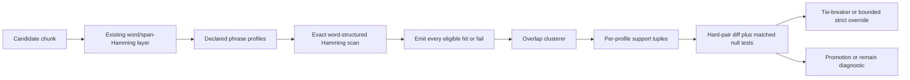

# Refining a Production-Safe Phrase-Coherence Scorer for Damaged No-Separator Text

## Executive summary

The baseline conclusion already on the table is the right one: the safest first production phrase-coherence model is still **exact word-structured phrase Hamming**, not joined-phrase Hamming, not edit distance, and not a learned language-model reranker. What changes in this second-pass review is **how tightly that model is governed**. Given your own prior audit, the scorer should optimise for **break-constrained incremental evidence** rather than hit volume: it must add phrase coherence beyond the existing word/span-Hamming layer, while behaving nothing like the earlier high-volume `repeated_3gram_rate` feature that rescued many cases but broke many more. The project constraints also remain binding: all eligible hits must be counted exactly, with no caps, no top-k, no silent dropping, and normal and strict cuts must stay separate. fileciteturn0file0 fileciteturn0file1

The most robust pragmatic design is therefore: **small declared profile families, exact all-hit emission, overlap clustering, separate normal and strict support tuples, and promotion only through hard-pair rescue/break analysis plus matched post-word-Hamming nulls**. This recommendation is consistent with the approximate-string-matching literature: exact **k-mismatch/Hamming** methods are a natural fit for equal-length comparison problems and have mature exact algorithms, whereas edit distance is more computationally demanding and introduces extra alignment freedom that can “explain away” bad candidates; the literature also shows that **approximately periodic** text can generate many low-k occurrences, which is the closest theoretical analogue to the failure mode you already observed in repeated local structure. citeturn20academia2turn20academia3turn18academia0turn12academia5

The key refinement is that **P1 length ≥ 7 / HD ≤ 2 is not a universal phrase rule**. It is useful, but it is inherited from the single-word layer and should be treated as **soft coverage evidence**, not as the unqualified centre of phrase scoring. For phrase coherence, the centre should move to **3-gram profiles with tighter per-word control or slightly longer total length**, while **4-grams** act as stronger confirmation and **length-18/HD2 style evidence** is only **high-confidence support**. Under a simple independent-substitution sanity check, a true length-18 phrase survives an HD≤2 gate only about **27%** of the time at 20% corruption, about **6%** at 30%, and under **1%** by 40%; that makes it excellent confirmation but much too sparse to be central coverage. The damage range in view remains 20% to 50%, so the scorer must prefer **positive support that survives moderate damage** over beautiful but rare near-clean islands. fileciteturn0file1

The practical upshot is straightforward. **Implement now**: exact word-structured scanning, immutable profile manifests, non-overlapping cluster aggregation, separate normal/strict tuples, hard-pair rescue/break reporting, and matched null generators that preserve local word-like evidence while destroying phrase coherence. **Keep report-only for now**: order-2 scoring, order-5 scoring, counts/log-counts, joined-phrase Hamming, skip/gapped phrase evidence, edit distance, noisy-channel scoring, n-gram LM likelihoods, and WFST composition. That staging is consistent with the literature: q-gram and seed methods are best treated as acceleration/filtering machinery rather than semantic scores, while noisy-channel, language-model, and WFST approaches become attractive only once segmentation, counts, and error probabilities are stable enough to calibrate. citeturn20academia0turn19academia6turn17academia7turn17academia5turn10academia2turn10academia3turn21search0turn13academia4turn15academia1

## Decision memo

| Topic | Recommended decision | Operational rule |
|---|---|---|
| Optimisation target | Optimise for **break-constrained incremental rescue** | Promote profiles only if they add pairwise evidence beyond word/span-Hamming and keep breaks tiny |
| Core model | Keep **word-structured phrase Hamming** as v1 | Identity stays on `direction × cut × order × canonical word_token_ids`; flattened runes are scanning compatibility only |
| Score unit | Use **clustered phrase support**, not raw hits | Aggregate into non-overlapping coherence clusters and compare support tuples lexicographically |
| P1 length ≥ 7 / HD ≤ 2 | **Not** a universal central rule | Treat it as soft coverage; stricter or longer profiles should carry score-bearing decisions |
| Normal versus strict | Keep **separate tuples** | Normal provides coverage/tie-break support; strict provides confirmation and narrow bounded override |
| Override policy | Phrase evidence should **not** become a direct additive score in v1 | Use report-only by default, tie-breaker in close margins, and a very narrow strict bounded override only for strongest profiles |
| Count weighting | **Disabled in v1** | Record raw/log counts diagnostically only; do not weight score-bearing hits with sample-mode counts |
| Order roles | 3-grams centre, 4-grams confirm, 2-grams weak/diagnostic, 5-grams diagnostic | No order-2 score-bearing role in the first promotion run; order-5 remains sparse confirmation telemetry |
| Skip/gapped evidence | **Deferred** | Add only if contiguous profiles miss genuine cases and fixed-mask gapped profiles meet the same break-constrained gates |
| Smallest safe next run | Freeze a **small ladder** and test on hard pairs plus matched nulls | Four score-bearing profiles, three diagnostic profiles, Python reference first, C++ only after parity |

These decisions follow directly from the project constraints and prior audit, and they line up with what the wider literature says about exact k-mismatch matching, approximate periodicity hazards, filtration versus scoring, and the calibration burden of richer probabilistic models. fileciteturn0file0 fileciteturn0file1 citeturn20academia2turn20academia3turn12academia5turn20academia0turn17academia7turn10academia2turn21search0turn13academia4

| Explicit assumption used in this review | Why it matters |
|---|---|
| Corruption is **substitution-dominant** in v1 | Hamming remains a sensible central metric only under mostly equal-length corruption |
| Phrase scorer is a **second-stage support layer** | It should confirm ordered coherence beyond the existing word/span layer rather than replace it |
| v1 scope is **FWD only** | This keeps the first experiment interpretable and aligns with the current asset scope |
| Asset counts may be **sample-mode / unreliable** | Count weighting must stay diagnostic until asset completeness is guaranteed |
| All-hit exactness is **non-negotiable** | Any fast backend must preserve score-affecting hit counts exactly or fail clearly |

Those assumptions are not generic; they come from the current scorer contract and asset scope already described for this project. fileciteturn0file1



The pipeline above is the practical consequence of combining your project constraints with the literature’s warning that approximate matches become statistically dangerous once repeated structure or richer alignment machinery is allowed to dominate without a strict verification contract. fileciteturn0file1 citeturn12academia5turn18academia0turn13academia4

## Method implications and threshold logic

The central reason to keep **word-structured Hamming** is not simply that it is cheap. It is that it preserves the **word geometry** you already paid to model in the phrase assets: canonical word identity, per-word lengths, and per-word mismatch bounds. Joined-phrase Hamming throws away this structure, and that is especially unsafe here because your own identity rule explicitly says that phrase identity depends on structured `word_token_ids`, not on the flattened token sequence alone. Edit distance buys tolerance to insertions and deletions, but it also introduces more alignment freedom, more explanation space for bad candidates, and more computational burden. q-gram/split-index methods and approximate seeds are valuable engineering tools, but they are **filters or accelerators**, not the semantic scoring primitive. Noisy-channel, language-model, and WFST methods are more expressive still, but they need cleaner segmentation, trustworthy counts, and actual error calibration before they become production-safe ranking evidence. fileciteturn0file1 citeturn20academia2turn20academia3turn18academia0turn20academia0turn19academia6turn17academia7turn17academia5turn10academia2turn10academia3turn21search0turn13academia4turn15academia1

| Method | Best property after a word/span prefilter | Main problem in this exact setting | Practical cost | Determinism | Recommended status |
|---|---|---|---|---|---|
| Word-structured phrase Hamming | Preserves word boundaries, supports exact per-word gates, matches equal-length k-mismatch thinking | Misses true indels unless promoted later | Low to medium | High | **Primary v1 scorer** |
| Joined-phrase Hamming | Very simple exact scanner | Collapses boundary-distinct phrases and lets one word absorb the full error budget | Low | High | Diagnostic only |
| Edit distance | Handles insertions and deletions | More expensive, harder to interpret, easier to overfit as a second-stage scorer | Medium to high | High | Defer unless indels are empirically common |
| q-gram / split-index filter+verify | Strong accelerator for exact verification | A filtration stage is not a stable semantic score | Medium | High if exact verify follows | Backend acceleration later |
| Spaced seeds / skip-grams | Can recover sensitivity in sparse/noisy conditions | High-volume candidate generation can recreate the repeated-feature failure mode | Medium to high | High if masks fixed | Defer/report-only |
| Noisy-channel scoring | Principled factorisation of prior and corruption model | Requires calibrated error model and reliable priors | High | High if fixed | Later |
| n-gram LM likelihoods | Strong contextual prior once tokenisation is stable | Damaged no-space streams and unreliable counts make it brittle here | Medium to high | High | Later diagnostic reranker |
| WFST / weighted automata | Excellent formalism for later composition of dictionaries, error models and priors | Too much engineering overhead for the first score-bearing phrase layer | High | High | Later framework, not v1 score |

This comparison reflects the approximate-string-matching surveys and algorithmic work, exact k-mismatch literature, split-index/q-gram filtering results, approximate-seed literature, modern n-gram modelling practice, and weighted-automata composition work. citeturn19academia7turn20academia2turn20academia3turn18academia0turn20academia0turn17academia7turn17academia5turn10academia2turn10academia3turn13academia4turn15academia1

The most important conceptual lesson from your prior audit is that the danger is **not simply noise**; it is **structured repetitive noise**. The nearest theoretical analogue is the approximate-periodicity result for k-mismatch matching: when text or pattern is approximately periodic, the number of low-k occurrences can grow in ways that make raw occurrence counts misleading. That is exactly why a feature like `repeated_3gram_rate` can look productive on rescue count but remain operationally bad. Phrase profiles must therefore be judged mainly by **clustered, diverse, low-break support**, not by how many total hits they can generate. fileciteturn0file1 citeturn12academia5turn20academia3

| P1 length ≥ 7 / HD ≤ 2, interpreted by order and cut | 20% damage | 30% damage | 40% damage | 50% damage | Verdict |
|---|---|---|---|---|---|
| 2-gram normal | Weak support only | Diagnostic only | Diagnostic only | Off | Too easy to inflate |
| 2-gram strict | Weak support only | Weak support only | Diagnostic only | Off | Better than normal, still not central |
| 3-gram normal | **Central coverage** if clustered and break-tested | **Central coverage** if paired with stricter confirmers | Tie-break only | Report-only | Useful, but not alone |
| 3-gram strict | Confirmation | Confirmation | Bounded confirmer | Report-only | Best balance of reach and precision |
| 4-gram normal | Confirmation | Confirmation | Sparse high-confidence support | Report-only | Stronger but naturally sparser |
| 4-gram strict | Bounded override candidate | Bounded override candidate | Confirmation only | Diagnostic only | Highest precision, low coverage |

This table is the direct answer to whether P1 is “central” or merely a carry-over from single-word evidence. It is **not** central across the board. It becomes central only for **3-gram coverage**, and even then only after clustering, null-testing, and separate strict confirmation are in place. For 2-grams it is too permissive; for 4-grams it becomes confirmation rather than coverage. fileciteturn0file1

A single **normalised Hamming threshold** is also the wrong abstraction for v1. Length 7 / HD2 and length 18 / HD2 have the same normalised HD only in the most superficial arithmetic sense; operationally they are totally different events. The right compromise is to keep **explicit profile families** with **length buckets**, plus a **max-word-HD gate**, while recording `normalised_phrase_hd` and a simple binomial or expected-survival score only as **diagnostic fields**, not as the main production score. This preserves interpretability, aligns with your “no fitted weights” requirement, and avoids collapsing rare high-confidence evidence together with broader mid-length coverage evidence. fileciteturn0file1

The chart below is an **analytic sanity check**, not an empirical benchmark. It assumes independent substitutions only. It still makes the central point clear: **length-18/HD2 is confirmation, not coverage**.

```mermaid
xychart-beta
    title "Idealised true-hit survival under substitution-only damage"
    x-axis [20%, 30%, 40%, 50%]
    y-axis "P(hit survives)" 0 --> 0.9
    line "7/2" [0.852, 0.647, 0.420, 0.227]
    line "8/2" [0.797, 0.552, 0.315, 0.145]
    line "10/3" [0.879, 0.650, 0.382, 0.172]
    line "18/2" [0.271, 0.060, 0.008, 0.001]
```

| Phrase geometry | 20% damage | 30% damage | 40% damage | 50% damage | IID random-29 impostor upper bound |
|---|---:|---:|---:|---:|---:|
| Length 7, HD ≤ 2 | 0.852 | 0.647 | 0.420 | 0.227 | 9.66×10⁻⁷ |
| Length 8, HD ≤ 2 | 0.797 | 0.552 | 0.315 | 0.145 | 4.43×10⁻⁸ |
| Length 10, HD ≤ 3 | 0.879 | 0.650 | 0.382 | 0.172 | 6.35×10⁻⁹ |
| Length 12, HD ≤ 3 | 0.795 | 0.493 | 0.225 | 0.073 | 1.38×10⁻¹¹ |
| Length 18, HD ≤ 2 | 0.271 | 0.060 | 0.008 | 0.001 | 5.72×10⁻²² |

The random-text bound is deliberately naïve because your real null is **much harder** than IID 29-symbol noise after the word/span prefilter. Even so, it usefully shows why long near-exact hits are phenomenally strong when they occur, while still being too fragile to anchor the whole ranking model. The alphabet size and damage range used in this sanity check come from the present system assumptions. fileciteturn0file1

## Profile ladder and aggregation

The safest answer to the normal-versus-strict question is **not** to pick one. Normal and strict should stay as **separate score tuples**, with **strict acting as bounded confirmation**, not as a replacement for normal coverage. Your prior dictionary-cut result already points this way: strict improves precision meaningfully, but it also removes many short words and did not yet prove, by itself, that it fully cleans false highs. That makes “strict-only” too sparse and “normal gated by strict” too brittle, especially as corruption rises. fileciteturn0file1

| Final-score use of normal and strict cuts | Judgement | Why |
|---|---|---|
| Normal-only coverage score | No | Too permissive; risks becoming another high-volume feature |
| Strict-only confirmation score | No | Too sparse for full coverage, especially at higher damage |
| Normal score gated by strict evidence | No in v1 | Over-brittle at 40–50% damage |
| Strict as bounded override | **Yes** | Best role for highest-precision evidence |
| Separate score tuple with no merge | **Yes** | Best base representation and easiest to audit |
| Profile-specific hard-pair reporting only | **Yes** | Mandatory for promotion and debugging |

This is the direct answer to question C: the recommended v1 is **option 5 as the core representation**, plus **option 4 as the only narrow scoring privilege for strict**, plus **option 6 as mandatory diagnostics**. fileciteturn0file1

The first-run ladder should stay genuinely small. The goal of the next run is **interpretability**, not coverage maximalism.

| profile_id | Order set | Cut set | Min phrase token length | Max total HD | Max word HD | Score-bearing | Expected role | Expected risk |
|---|---|---:|---:|---:|---:|---|---|---|
| `B2R` | 2 | normal, strict reported separately | 7 | 2 | 2 | No | Weak support telemetry only | **Dangerous** |
| `N3S_diag` | 3 | normal | 7 | 2 | 2 | No | Soft P1 diagnostic; test whether carry-over is too loose | Dangerous |
| `N3C` | 3 | normal | 8 | 2 | 1 | Yes | Main coverage profile | Medium |
| `S3W` | 3 | strict | 7 | 2 | 2 | Yes | High-precision confirmer with moderate reach | Low to medium |
| `N4L` | 4 | normal | 10 | 3 | 2 | Yes | Strong confirmation | Medium to low |
| `S34C` | 3, 4 | strict | 10 | 2 | 1 | Yes | Bounded override candidate | Low |
| `F5D` | 5 | normal, strict reported separately | 12 | 3 | 2 | No | Sparse diagnostic/high-confidence telemetry | Sparse, not central |

This ladder answers question E. It is intentionally **not** dozens of profiles. It contains four score-bearing profiles and three diagnostic profiles. Exact hits are **not** launched as a separate profile family in the first run; instead, exactness is exposed via hit and cluster fields within these profiles, which keeps the ladder small without hiding exact evidence. The ladder also reflects your own baseline ordering of importance—3-grams as the centre, 4-grams as confirmation, 2-grams as weaker support, and 5-grams as diagnostic—while making the risky soft-normal 3-gram profile diagnostic first rather than trusted immediately. fileciteturn0file0 fileciteturn0file1

The correct v1 hit aggregation is **not** a scalar. Raw hit count is too easy to game with repeated local structure; best-hit-only throws away valuable distributed evidence; unique offset count still inflates under periodic text; and top-k is already ruled out by contract. The right v1 aggregate is therefore a **support tuple** built around **non-overlapping cluster count**, plus strongest-hit metadata, while retaining raw counts only for diagnostics. This is the most direct safeguard against accidentally rebuilding a repeated-feature failure mode under a new name. fileciteturn0file1 citeturn12academia5

| Aggregate field | Level | Score-bearing | Why it belongs |
|---|---|---|---|
| `profile_id` | profile | Yes | Immutable profile identity is required for auditability |
| `raw_hit_count` | profile | No | Useful for debugging inflation, unsafe as score |
| `unique_phrase_id_count` | profile | No | Detects whether volume comes from one repeated phrase or many |
| `unique_offset_count` | profile | No | Diagnoses positional spread |
| `cluster_count` | profile | **Yes** | Main anti-gaming unit; counts distinct coherence regions |
| `strict_confirmed_cluster_count` | family | **Yes** | Strongest confirmatory summary |
| `exact_cluster_count` | profile | **Yes** | Captures exact support without adding a new profile family |
| `best_hit_signature` | profile | **Yes** | Tie-break metadata: `(cut, order, phrase_len, total_hd, max_word_hd, exact_flag)` |
| `top_phrase_share` | profile | No | High values expose repeated-local-structure inflation |
| `raw_to_cluster_ratio` | profile | No | Core null diagnostic; repeated features inflate this ratio |
| `new_vs_span_overlap_tokens` | profile | No | Measures incrementality beyond existing word/span evidence |
| `bounded_examples` | profile | No | Human debugging only; never score-bearing |

The final pairwise phrase comparison should therefore be **lexicographic by profile strength**, not additive across heterogeneous evidence. A practical v1 ordering is: compare `S34C` first, then `S3W`, then `N4L`, then `N3C`; use `exact_cluster_count` and `best_hit_signature` only within ties; keep `B2R`, `N3S_diag`, and `F5D` out of ranking decisions. That directly answers question F and also keeps the implementation aligned with the “explicit profile families rather than one fitted score” baseline. fileciteturn0file0 fileciteturn0file1

Count and log-count fields from the assets should remain **disabled for scoring in v1**. Record them, expose them, and audit them, but do not let them influence pair ranking until full-asset completeness is guaranteed. If count-based weighting is added later, it should be weak, clipped, and probably closer to **inverse-frequency or continuation-style weighting** than to raw count mass; that direction is more consistent with what language-modelling work has learned about sparse counts and over-common contexts. For the current second-stage damaged-text problem, though, raw count weighting is far more likely to add hidden bias than clean signal. fileciteturn0file1 citeturn8academia1turn10academia2turn10academia3

## Nulls, promotion, and evaluation

The correct post-word-Hamming null is **not random 29-symbol text**. After the existing word/span layer, the null must already contain **local damaged word-like evidence** and yet still lack real phrase coherence. Otherwise the phrase scorer will look better than it really is. This is especially important because your prior audit already showed that a repeated-structure feature can generate many apparent rescues while doing substantial damage overall. The nulls therefore need to preserve the kinds of local structure the first layer already likes. fileciteturn0file1

| Null generator | Construction idea | What it preserves | What it destroys | Required diagnostics |
|---|---|---|---|---|
| `offset_permute_null` | Keep the same detected local word/span hits, but randomly permute their offsets within the chunk | Word-hit histogram by length/HD; token content | Ordered phrase adjacency | Raw hits, clusters, top-phrase-share, winner/loss flips |
| `window_collage_null` | Cut short windows centred on strong word/span hits from multiple weak candidates and stitch them together | Local word-like islands; local token statistics | Longer phrase continuity across windows | Cluster count lift versus source, strict-cluster lift, false overrides |
| `periodic_decoy_null` | Generate text that preserves repeated-local-structure statistics and short-token repetition from the candidate | Repetition profile, repeated-3gram pressure, short-cycle motifs | True lexical phrase identity | Raw-to-cluster ratio, top-phrase-share, profile inflation by order |
| `length_matched_phrase_swap_null` | Replace matched words with other dictionary words of the same token lengths and similar single-word HD budgets | Word lengths, local HD distributions | Genuine phrase identity and semantic coherence | Whether phrase scorer is responding to geometry alone |
| `strict_decoy_null` | Preserve normal-cut local evidence, then inject strict-cut decoy words of comparable lengths where possible | Comparable local support difficulty | True strict coherence | Strict-hit precision, strict false-trigger rate |

The closest theoretical reason for these nulls is again approximate periodicity and seed-based filtration behaviour: once repeated local structure or seed hits can proliferate, a score based on raw volume stops being trustworthy unless it is tested against nulls that preserve that nuisance structure. citeturn12academia5turn17academia7turn17academia5

A profile should be promoted by a **practical hard-pair rule**, not by aesthetic preference. The following gate is deliberately conservative.

| Promotion metric | Coverage profile gate | Confirmation / bounded-override gate | Why |
|---|---:|---:|---|
| Minimum changed-pair sample | at least 15 changed pairs | at least 8 changed pairs | Tiny samples are too unstable |
| Minimum rescues | `max(10, 5% of baseline-wrong pairs)` | `max(5, 2% of baseline-wrong pairs)` | Avoid promoting profile curiosities |
| Maximum breaks | 2 | 1 | Breaks are much costlier than rescues |
| Minimum rescue precision | 0.80 | 0.90 | Confirmation must be cleaner than coverage |
| Minimum net rescues | +6 | +4 | Rescue volume must survive break penalty |
| Minimum incremental rescues beyond word/span | 30% of rescues, and at least 5 pairs | 50% of rescues, and at least 3 pairs | Phrase layer must add something genuinely new |
| Strict-hit precision | diagnostic only unless ≥0.90 | must be ≥0.90 | Strict should mean something operationally |
| Null lift on cluster count | ≥3× winner over matched null median | ≥5× | Prevent a new repeated-feature failure |
| Concentration check | no single canonical phrase or candidate accounts for >25% of rescues | same | Prevent one brittle pattern from “passing” the gate |

This table is the direct answer to question A. Rescue count matters, but **only** inside a break-constrained and incrementality-constrained gate. Correlation with the existing word/span score should be recorded, but it should **not** be a promotion criterion by itself. If a profile is highly correlated and still adds low-break incremental rescues on close pairs, that is fine; if it is “independent” but breaks too much, it should not ship. fileciteturn0file1

The hard-pair report should be explicit enough that rescues and breaks can be traced back to concrete support, not just to scalar score deltas.

| Recommended hard-pair evaluation field | Purpose |
|---|---|
| `pair_id` | Stable evaluation identity |
| `gold_winner` | Ground truth |
| `baseline_winner` | Existing word/span result |
| `phrase_mode` | `report_only`, `tie_break`, or `bounded_override` |
| `phrase_winner` | Winner under phrase evidence regime |
| `outcome_class` | `rescue`, `break`, `no_change_right`, `no_change_wrong`, `soft_support`, `soft_break` |
| `baseline_margin_quantile` | Whether phrase only acted on close calls |
| `winner_profile_tuple` | Full per-profile tuple for promoted candidate |
| `loser_profile_tuple` | Full per-profile tuple for losing candidate |
| `delta_strict_clusters` | Difference in strict-confirmed clusters |
| `delta_core_clusters` | Difference in score-bearing core clusters |
| `delta_best_hit_signature` | Why the tie broke |
| `incremental_beyond_span` | Whether phrase evidence contradicted or merely echoed word/span evidence |
| `override_triggered` | Whether narrow override conditions were used |
| `null_generator_id` | If this comparison is synthetic/null-based |
| `top_phrase_share_winner` | Inflation diagnostic |
| `notes` | Human audit trail |

That schema directly answers the request for a hard-pair evaluation table and also makes the rescue/break logic inspectable enough to support promotion and later backend parity testing. fileciteturn0file1

Phrase evidence should not be allowed to override the existing word/span ranking broadly. The safest v1 rule is: **report-only by default, tie-breaker on close margins, bounded strict override only on the strongest strict-long profiles, and never a direct additive global score**. Operationally that means a combination of your options **2 and 3**, not 4. The override should only fire when: a strong strict profile such as `S34C` favours one candidate, the competing candidate lacks comparable strict support, and the baseline margin lies in a predefined “close-call” band such as the lowest decile of absolute baseline margins on the validation set. Absence of phrase hits should still not be penalised. fileciteturn0file0 fileciteturn0file1

Skip/gapped phrase evidence should be **deferred**. The literature does support approximate seeds and skipped contexts as useful for sensitivity and sparse data, but your present failure mode is about **too much fragile structure masquerading as evidence**, not too little model capacity. Add gapped support only if a later audit shows a consistent pattern of false negatives where local word hits align plausibly with correct phrase order but contiguous profiles miss, and only if **fixed-mask** gapped profiles meet the same no-cap and break-constrained promotion gates. Until then, keep skip/gapped evidence report-only. citeturn17academia7turn17academia5turn10academia3

## Production contract and next experiment

A production-safe scorer needs a contract that is richer than “return a score”. It must expose the full basis on which ranking happened, because the entire goal of this layer is to produce **auditable phrase evidence**, not just another opaque number.

| Required manifest or record | Minimum fields |
|---|---|
| `asset_manifest` | asset build id, direction, cut, order, count mode (`full` or `sample`), phrase count, checksum |
| `profile_manifest` | profile id, order set, cut set, min length, max total HD, max word HD, score-bearing flag, clustering rule version |
| `run_manifest` | implementation id, implementation hash, Python/C++ mode, candidate ids, chunk ids, fail-fast flags, timestamp |
| `hit_record` | profile id, cut, order, candidate id, chunk id, phrase id, start/end offsets, phrase length, word HD vector, total HD, max word HD, exact flag |
| `cluster_record` | profile id, candidate id, chunk id, cluster id, covered interval, raw hit count, unique phrase count, best hit signature, exact hit presence |
| `candidate_summary` | per-profile tuple, strict-cluster counts, exact-cluster counts, raw-to-cluster ratios, top-phrase-share |
| `pair_report` | fields from the hard-pair table above |
| `diagnostic_summary` | null lifts, inflation metrics, parity status, failure flags |

Those manifests are specifically needed because your project rules now forbid silent caps, silent fallback, and silently dropped eligible hits. A fast backend without these records would not be production-safe under the contract you have already described. fileciteturn0file1

The trust gate for any later C++ backend should be much harsher than usual, precisely because the prior lessons were about subtle ranking breakage rather than obvious crashes.

| Risk or failure mode | Why it is specifically dangerous here | Required test before trust |
|---|---|---|
| Silent hit truncation | Violates the core no-cap contract | All-hit no-cap tests on dense synthetic cases |
| Boundary collapse | Different word structures can share flattened runes | Identity tests with same `rune_token_ids`, different `word_token_ids` |
| Normal/strict bleed-through | Destroys the intended precision separation | Strict/normal separation tests and manifest-based assertions |
| Repeated-local-structure inflation | Recreates the `repeated_3gram_rate` failure mode | Periodic/null tests; monitor raw-to-cluster ratio and top-phrase-share |
| Soft P1 overreach | Lets single-word prior masquerade as phrase evidence | Compare `N3S_diag` against `N3C` on the same hard-pair set |
| Long-phrase fetish | Beautiful but sparse evidence can under-cover damaged truth | Damage-stratified audits by 20/30/40/50% corruption bins |
| Count-mode leakage | Sample-mode counts contaminate score | Force count weighting off unless `asset_manifest.count_mode == full` |
| Backend drift | Independent implementation changes ranking semantics | Python/C++ parity on hits, clusters, tuples, pair outcomes |
| Non-deterministic ordering | Makes hard-pair reports unreproducible | Stable sorting tests and deterministic serialisation checks |

| Required test family | Minimum synthetic case |
|---|---|
| Synthetic exact-hit tests | Inject exact 3-gram and 4-gram phrases at known offsets and assert exact counts |
| Boundary identity tests | Two phrases with identical flattened runes but different word boundaries must remain distinct |
| All-hit no-cap tests | Dense overlapping-hit candidate designed to exceed any normal debug-example bound |
| Strict/normal separation tests | Same candidate scored with both cuts; summary tuples must remain separate |
| Profile-manifest tests | Any change to threshold or role must alter manifest hash and invalidate parity |
| Python/C++ parity tests | Bit-for-bit equality on hit counts, cluster counts, exact flags and pair outcomes |
| Rescue/break report tests | Golden hard-pair fixtures with expected rescue/break classification |
| Null-generator tests | Verify that designed word-hit marginals are preserved while phrase order is broken |

These tests are the direct answer to question K. They are not optional polish; they are the minimum evidence that the scorer is still the same scorer after optimisation. fileciteturn0file1

The **smallest safe next experiment** is this: freeze the asset manifest; freeze the seven-profile ladder above; run a **Python reference implementation first** on the existing hard-pair benchmark; score in three offline modes—`report_only`, `tie_break`, and `bounded_override`; and augment every real candidate with matched null variants from at least three null generators (`offset_permute_null`, `window_collage_null`, `periodic_decoy_null`). Do **not** let phrase evidence directly add into the main score during this experiment. Let it act only through the three simulated decision regimes, and promote only the profiles that clear the break-constrained gates. That experiment is small enough to interpret and realistic enough to expose exactly the kinds of breaks your earlier span-Hamming audit warned about. fileciteturn0file1

| Implement next | Keep report-only for now |
|---|---|
| Exact word-structured Hamming scanner with no-cap contract | Order-2 ranking use |
| Immutable asset/profile/run manifests | Order-5 ranking use |
| Overlap clusterer and per-profile support tuples | Counts/log-count weighting |
| Hard-pair rescue/break reports | Joined-phrase Hamming |
| Matched post-word-Hamming null generators | Edit-distance phrase scoring |
| Four score-bearing profiles: `N3C`, `S3W`, `N4L`, `S34C` | Skip/gapped phrase scoring |
| Three diagnostic profiles: `B2R`, `N3S_diag`, `F5D` | Noisy-channel scoring |
| Python reference first, independent C++ parity second | n-gram LM reranking |
| Tie-breaker and narrow strict bounded-override simulation | WFST composition in ranking path |
| Exactness fields such as `exact_cluster_count` and `best_hit_signature` | Absence penalties |

The clear answer to “what should we implement next?” is therefore: **the exact scanner, the cluster-based support tuples, the small frozen ladder, the hard-pair diff, and the matched nulls**. The clear answer to “what should remain report-only?” is: **everything more permissive, more globally weighted, or more model-rich than that** until it proves it can add incremental rescues without recreating the repeated-structure break pattern already seen in the earlier audit. fileciteturn0file0 fileciteturn0file1